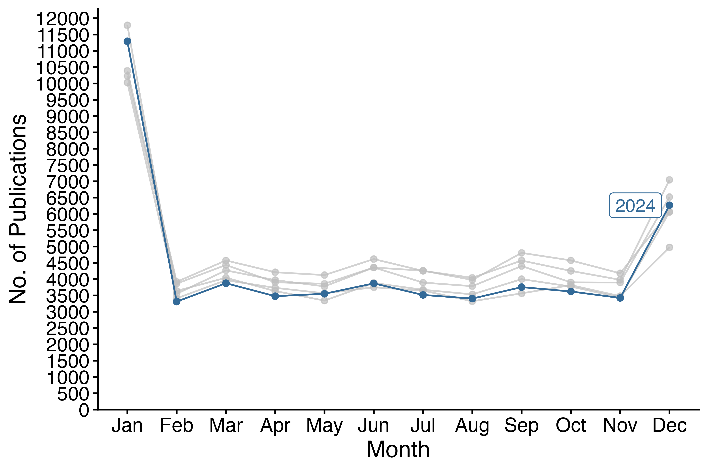
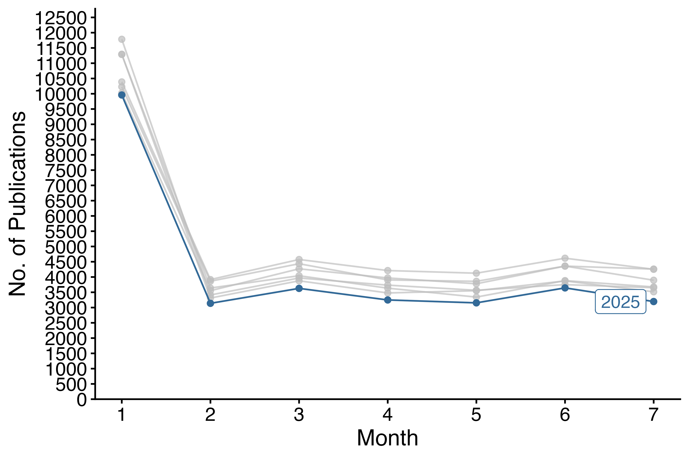
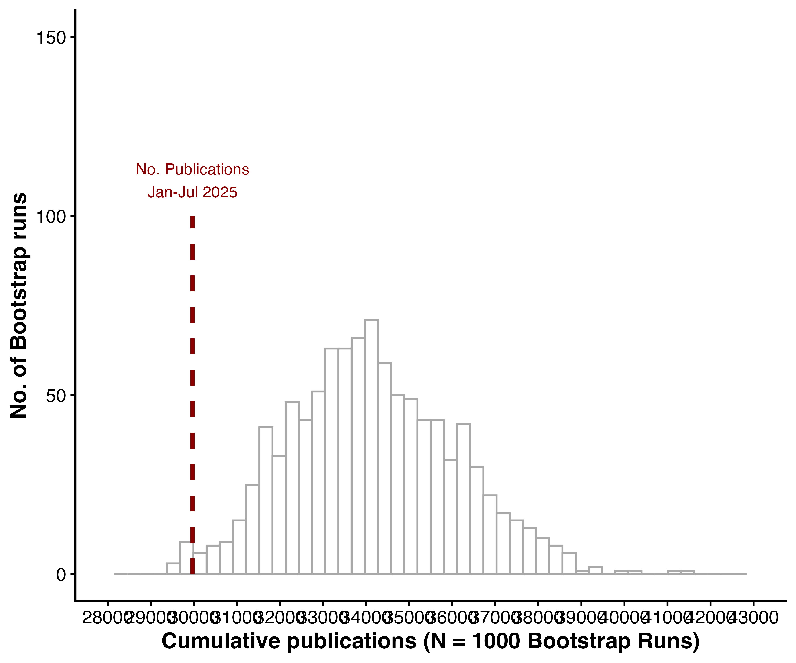

# Publications by the 10 institutions publishing the most papers (between Jan 2019 & May 2025

\bigskip

```{r setup, include=FALSE}

library(tidyverse)
library(janitor)
library(gghighlight)
library(kableExtra)
library(data.table)
# library(knitr)

knitr::opts_chunk$set(echo = FALSE, message=FALSE,warning=FALSE)

options(scipen=999)

comma <- function(x) format(x, digits = 2, big.mark = ",")

knitr::opts_chunk$set(fig.pos = 'H')

```


```{r data, cache=TRUE, echo=FALSE}

# Read data
#  fed affils -------------------------------------------------------------
# 

papers_df  <- setDT(read_rds("./data_clean/papers_df_uni_clean.rds")) 
papers_df <- papers_df %>% 
  mutate(PM=
           case_when(
             is.na(PM) ~ sample(c(1:12), 1, replace = TRUE),
             .default = as.numeric(PM)
           )
  ) %>% 
  remove_empty(c("rows","cols")) %>% 
  tibble()
  


authors_df <- setDT(readRDS("./data_clean/authors_df_uni_clean.rds")) %>% 
remove_empty(c("rows","cols")) %>% 
  mutate(uni = case_when(
    uni=="minn"~"other",
    uni=="unc_ch"~"other",
    uni=="ohio_state"~"other",
    .default = as.character(uni)
  ))

# 
PY_for_authors_df<-papers_df %>%
   select(refID,PY,PM)
authors_df <- authors_df %>%
left_join(PY_for_authors_df)
rm(PY_for_authors_df)
```

```{r totals, cache=TRUE, echo=FALSE}

total_pubs<-papers_df %>% 
  summarize(n=n_distinct(refID))

# Total_authors (focal uni+ non)
total_authors<-authors_df %>% 
  select(authorID) %>% 
  distinct() %>% 
  tally()


total_focal_uni<-authors_df %>% 
  filter(uni!="other") %>% 
  select(authorID) %>% 
  distinct() %>% 
  tally()

total_NOTfocal<-authors_df %>% 
  filter(uni=="other") %>% 
  select(authorID) %>% 
  distinct() %>% 
  tally() 
  

first_authors <- authors_df %>%
  filter(uni!="other") %>% 
  filter(author_order == 1) 


prop_papers_univ_1st<-nrow(first_authors)/ total_pubs*100

last_authors <- authors_df %>%
  group_by(refID) %>%
  slice_tail() %>%
  filter(author_order != 1) %>%
  filter(uni!="other")

prop_papers_univ_last<-nrow(last_authors)/ total_pubs*100


all_author_positions <- authors_df %>%
  filter(uni!="other") %>% 
  distinct(refID,uni,.keep_all=TRUE) %>% 
  arrange(refID)

```


```{r authors_per_pub, cache=TRUE, echo=FALSE}
# Authors per pub

auth_per_pub<-authors_df %>% 
  group_by(refID) %>% 
          summarize(FocalUni=sum(uni!="other"),
          nonFocalUni=sum(uni=="other"),
          total=sum(FocalUni+nonFocalUni))

auth_per_pub_means<-auth_per_pub %>% 
  ungroup() %>% 
  drop_na() %>% 
  summarize(
    avg_FocalUni=mean(FocalUni),
    sd_FocalUni=sd(FocalUni),
    avg_NonFocalUni=mean(nonFocalUni),
    sd_NonFocalUni=sd(nonFocalUni),
    avg_Total=mean(total),
    sd_Total=sd(total)
    ) %>%  
 pivot_longer(
    cols = starts_with("avg_"),
    names_to = "author_category",
    names_prefix = "avg_",
    values_to = "mean_per_pub",
    values_drop_na = TRUE
  ) %>% 
  mutate(sd=if_else(author_category=="Total",sd_Total,NA)) %>% 
  mutate(sd=if_else(author_category=="NonFocalUni",sd_NonFocalUni,sd)) %>% 
  mutate(sd=if_else(author_category=="FocalUni",sd_FocalUni,sd)) %>% 
  select(-sd_FocalUni,-sd_NonFocalUni,-sd_Total) 


```


\bigskip

# Summary: Total Publications, Total Authors, and Publications Per Year

\bigskip

## Search (SCOPUS API)


## Results


- **Total No. of Publications:** N = `r comma(total_pubs$n)`

- **Total No. of Authors:** N = `r comma(total_authors$n)`.

  > Authors with Focal University Affiliation (Primary): N = `r comma(total_focal_uni$n)`

  > Non-Focal University Authors: N = `r comma(total_NOTfocal$n)`

- **Author Position **

  > Articles with Focal University Author in 1st Author Position:  `r comma(prop_papers_univ_1st)`%

  > Articles with Focal University Author in Last Author position:  `r comma(prop_papers_univ_last)`%

- **Authors per Publication**:

  > Authors Per Publication: Mean = `r comma(as.numeric(auth_per_pub_means %>% filter(author_category=="Total") %>% select(mean_per_pub)))` (± `r comma(as.numeric(auth_per_pub_means %>% filter(author_category=="Total") %>% select(sd)))` SD)

  > Focal University Authors per Publication: Mean  = `r comma(as.numeric(auth_per_pub_means %>% filter(author_category=="FocalUni") %>% select(mean_per_pub)))` (± `r comma(as.numeric(auth_per_pub_means %>% filter(author_category=="FocalUni") %>% select(sd)))` SD)

  > Non-Focal University Authors per Publication Mean = `r comma(as.numeric(auth_per_pub_means %>% filter(author_category=="NonFocalUni") %>% select(mean_per_pub)))` (± `r comma(as.numeric(auth_per_pub_means %>% filter(author_category=="NonFocalUni") %>% select(sd)))` SD)

\bigskip


I searched SCOPUS for all indexed articles, reviews, letters, notes, book chapters, data papers, and editorial material published between 2019-2025 that included at least one author whose primary address was one of the following institutions:


### Articles indexed Monthly/Quarterly (2019-2024)

\bigskip


```{r  label = pubs_mo_yr_1_2, echo = FALSE, fig.cap = "Articles per month (2019-2024). Note: the the January-December peaks are likely due to journals journals publishing fewer than 12 issues per year. Smoothed out somewhat by converting to publications per quarter (see below).", out.width = '75%'}

```


\bigskip
\bigskip


### Publications Indexed Monthly January 1 - July 31 (2019-2025)

\bigskip

```{r  label = monthly_pubs_1_1, echo = FALSE, fig.cap = "Monthly publications from January 1 to May 31 (2019-2025).", out.width = '75%'}

```

### Cumulative Total Publications January 1 - June 30 (2019-2025)

\bigskip

```{r  label = cumulative_fig, echo = FALSE, fig.cap = "Cumulative number of articles published by focal universities between January 1-May 31, 2019-2025 and the percent change in 2025 productivity relative to the same time period in 2024 (red).", out.width = '75%'}

```


### Total Publications January 1 - June 30 (2019-2025)

\bigskip

```{r  label = fig_total_to_date_1_fig, echo = FALSE, fig.cap = "Articles published by researchers at 10 focal universities between January 1-May 31, 2019-2025 and the percent change in 2025 productivity relative to the same time period in 2024 (red). Numbers in blue are the number of articles published in 2024 and 2025.", out.width = '75%'}

```


\newpage

## Total publications (all author positions) from universities (1 January 2019 to 31 June 2025)

\bigskip


```{r table_uni_productivity, echo=FALSE, cache=TRUE}


total_pubs_per_uni_data <- authors_df %>% 
  select(refID,uni) %>% 
  distinct() %>% 
  drop_na() %>% 
  group_by(uni) %>% 
  summarize(n=n_distinct(refID)) %>% 
  filter(uni!="other") %>% 
  arrange(desc(n)) %>% 
  mutate(uni=case_when(
    uni=="mass_general"~"mass general",
    .default = as.character(uni)
  )
  )


  total_pubs_per_uni_table<-
total_pubs_per_uni_data %>% 
  rename(University=uni,
         N=n) %>% 
kable(digits = 2,
  format = "latex",
  caption = "Number of publications by focal universities",
  align = "ll",
  escape = FALSE,
  row.names = FALSE,
  booktabs = T,
  linesep = ""
) %>%
  kable_styling(
    bootstrap_options = c("hover"),
    # full_width = F,
    latex_options = c("scale_down","hold_position"),
    font_size = 12,
    position = "center"
  ) %>% 
  column_spec(2, width = "9em")
total_pubs_per_uni_table

```


\bigskip  
\bigskip  


<!-- Need to compare with non-government institutions. Note that they are systematically tearing apart the most proiductive institution in the world (by far) and the leading system in the world (no foreign university or system even in top 20, only two in top 30). -->

<!-- 2019-2025 Harvard Med through T & M: 1,087,647  -->

<!-- 2019, 156075 -->
<!-- 2020, 167548 -->
<!-- 2021, 179386 -->
<!-- 2022, 170367  -->
<!-- 2023, 164971 -->
<!-- 2024, 167700 -->
<!-- 2025, 81590  -->


<!-- inst, affil_code, inst_code -->

<!-- Harvard University 191469, 726046 and Harvard Medical School, 441574, 449547 -->
<!-- University of Michigan - Ann Arbor, 347907, 418348 -->
<!-- University of Washington, 329371, 373766 -->
<!-- University of Pennsylvania, 269101, 368273	 -->
<!-- Stanford University, 306475, 416740 -->
<!-- University of California - Los Angeles, 312016, 392573 -->
<!-- Massachusetts General Hospital, 209891, 215786	 -->
<!-- University of California - San Francisco, 241713, 265358 -->
<!-- University of California - San Diego, 264376, 288722 -->
<!-- University of Florida, 245598, 283685	 -->


<!-- NEED ALL	 -->
<!-- University of Minnesota Twin Cities -->
<!-- The Ohio State University -->
<!-- The University of North Carolina at Chapel Hill -->


<!-- University of Minnesota Twin Cities, 54,421 -->
<!-- The Ohio State University 51,023 -->
<!-- The University of North Carolina at Chapel Hill, 50,485 -->
<!-- University of Wisconsin-Madison, 49,806 -->
<!-- Brigham and Women's Hospital, 49,412 -->
<!-- Columbia University, 49,261 -->
<!-- University of California - Berkeley, 48,039 -->
<!-- Mayo Clinic, 47,718 -->
<!-- Johns Hopkins University School of Medicine, 46,385 -->
<!-- Johns Hopkins University,46,113 -->
<!-- University of California - Davis, 45,094 -->
<!-- Pennsylvania State University, 44,111 -->
<!-- Massachusetts Institute of Technology, 43,977 -->
<!-- Texas A and M University, 43,291 -->
<!-- <!-- Chinese Academy of Sciences, 41,952 --> 
<!-- The University of Texas at Austin, 41,739 -->
<!-- UCSF School of Medicine, 41,669 -->
<!-- <!-- CNRS Centre National de la Recherche Scientifique, 41,620 --> 
<!-- University of Illinois Urbana-Champaign, 41,161 -->
<!-- University of Pittsburgh, 41,037 -->
<!-- <!-- National Institutes of Health (NIH), 40,815 --> 
<!-- Northwestern University, 40,570 -->
<!-- Harvard University, 40,459 -->
<!-- Yale School of Medicine, 40,112 -->

