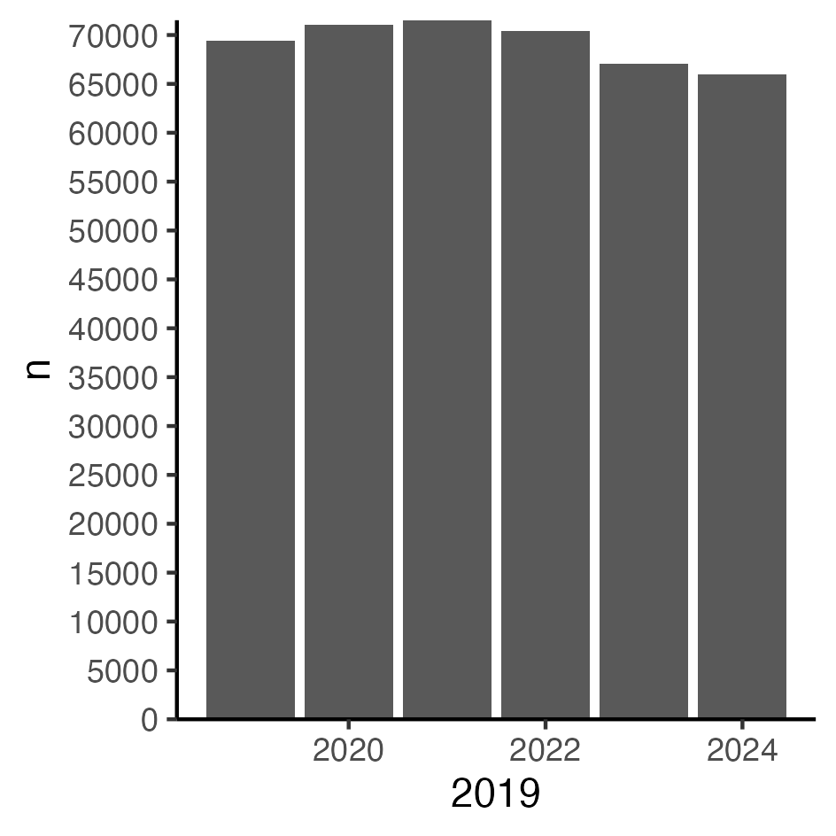

# Publications by US Federal Personnel (Jan 2019 - May 2025)

\bigskip

```{r setup, include=FALSE}

library(tidyverse)
library(janitor)
library(gghighlight)
library(kableExtra)
# library(knitr)

knitr::opts_chunk$set(echo = FALSE, message=FALSE,warning=FALSE)

options(scipen=999)

comma <- function(x) format(x, digits = 2, big.mark = ",")

knitr::opts_chunk$set(fig.pos = 'H')

```


```{r data, cache=TRUE }

# Read data
#  fed affils -------------------------------------------------------------
# 
papers_df  <- read_rds("./data_clean/papers_df_clean.rds") %>% 
  mutate(PM=
           case_when(
             is.na(PM) ~ sample(c(1:12), 1, replace = TRUE),
             .default = as.numeric(PM)
             )
         )


authors_df  <- read_rds("./data_clean/authors_df_clean.rds") 
# 
# authors_df %>% filter(agency=="interior") %>% select(AF,authorID) %>% group_by(AF) %>% tally() %>% arrange(desc(n))


# affils_df  <- readRDS("./data_clean/affils_df_clean.rds") 
```

```{r totals }

total_pubs<-papers_df %>% 
  summarize(n=n_distinct(refID))

# Total_authors (fed+non)
total_authors<-authors_df %>% 
  select(authorID) %>% 
  distinct() %>% 
  tally()


total_federals<-authors_df %>% 
  filter(federal==TRUE) %>% 
  select(authorID) %>% 
  distinct() %>% 
  tally()

total_NOTfederals<-authors_df %>% 
  filter(federal==FALSE) %>% 
  select(authorID) %>% 
  distinct() %>% 
  tally() 
  

first_authors <- authors_df %>%
  filter(federal == TRUE) %>%
  filter(author_order == 1) 


prop_papers_fed_1st<-nrow(first_authors)/ total_pubs*100

last_authors <- authors_df %>%
  group_by(refID) %>%
  slice_tail() %>%
  filter(author_order != 1) %>%
  filter(federal == TRUE) 

prop_papers_fed_last<-nrow(last_authors)/ total_pubs*100


all_author_positions <- authors_df %>%
  filter(federal == TRUE) %>%
  distinct(refID,agency,.keep_all=TRUE) %>% 
  arrange(refID)

```


```{r authors_per_pub }
# Authors per pub

auth_per_pub<-authors_df %>% 
  group_by(refID) %>% 
summarize(fed=sum(federal==TRUE),
          nonFed=sum(federal==FALSE),
          total=sum(fed+nonFed))

auth_per_pub_means<-auth_per_pub %>% 
  ungroup() %>% 
  drop_na() %>% 
  summarize(
    avg_Fed=mean(fed),
    sd_Fed=sd(fed),
    avg_NonFed=mean(nonFed),
    sd_NonFed=sd(nonFed),
    avg_Total=mean(total),
    sd_Total=sd(total)
    ) %>%  
 pivot_longer(
    cols = starts_with("avg_"),
    names_to = "author_category",
    names_prefix = "avg_",
    values_to = "mean_per_pub",
    values_drop_na = TRUE
  ) %>% 
  mutate(sd=if_else(author_category=="Total",sd_Total,NA)) %>% 
  mutate(sd=if_else(author_category=="NonFed",sd_NonFed,sd)) %>% 
  mutate(sd=if_else(author_category=="Fed",sd_Fed,sd)) %>% 
  select(-sd_Fed,-sd_NonFed,-sd_Total) 

# %>% 
#   rename(SD=sd,
#          `Mean per Paper`=mean_per_pub,
#          `Author Category`=author_category)
  
# 
# auth_per_pub_means %>%
# kable(digits = 2,
#   format = "latex",
#   align = "lcc",
#   caption = "Avg No of Federal and NonFederal Authors Per Publication",
#   escape = FALSE,
#   row.names = FALSE,
#   booktabs = T,
#   linesep = ""
# ) %>%
#   kable_styling(
#     bootstrap_options = c("hover"),
#     # full_width = F,
#     latex_options = c("scale_down","hold_position"),
#     font_size = 12,
#     position = "center"
#   )

```


I searched SCOPUS for all indexed articles, reviews, letters, notes, book chapters, data papers, and editorial material published between 2019-2025 that included at least one author with a United States federal government affiliation as their primary address. The search was conducted using Scopus' Affiliation Codes, the list of codes included both the primary codes for government agencies (i.e., US Department of Defense: 60012471; US Department of Commerce: 60000947) and for individual units within administered by those departments (Naval Dental Center: 60032984, National Oceanic and Atmospheric Administration: 60027716).  

_Note:_ Some USGS scientists are based at US universities via the Cooperative Fish and Wildlife Research Units Program. While these publications are returned by SCOPUS searches of the USGS code, the affiliation given for the USGS authors is that of the host university (e.g., USGS Scientists at the Florida Cooperative Fish and Wildlife Research Unit is "University of Florida"). To correct this I downloaded metadata from USGS [Publications Warehouse](https://pubs.usgs.gov/) for the N = 17,445 articles published between 2019-2025 and used it to identify all USGS authors and correct their affiliation in the SCOPUS records. 

\bigskip

# Summary: Total Publications, Total Authors, and Publications Per Year

\bigskip

- **Total No. of Publications:** N = `r comma(total_pubs$n)`

- **Total No. of Authors:** N = `r comma(total_authors$n)`

  > Authors with Federal Affiliation (Primary): N = `r comma(total_federals$n)`

  > Non-Federal Authors: N = `r comma(total_NOTfederals$n)`

- **Author Position **

  > Articles with Federal Author in 1st Author Position:  `r comma(prop_papers_fed_1st)`%

  > Articles with Federal Author in Last Author position:  `r comma(prop_papers_fed_last)`%

- **Authors per Publication**: 

  > Authors Per Publication: Mean = `r comma(as.numeric(auth_per_pub_means %>% filter(author_category=="Total") %>% select(mean_per_pub)))` (± `r comma(as.numeric(auth_per_pub_means %>% filter(author_category=="Total") %>% select(sd)))` SD)

  > Federal Authors per Publication: Mean  = `r comma(as.numeric(auth_per_pub_means %>% filter(author_category=="Fed") %>% select(mean_per_pub)))` (± `r comma(as.numeric(auth_per_pub_means %>% filter(author_category=="Fed") %>% select(sd)))` SD)

  > Non-Federal Authors per Publication Mean = `r comma(as.numeric(auth_per_pub_means %>% filter(author_category=="NonFed") %>% select(mean_per_pub)))` (± `r comma(as.numeric(auth_per_pub_means %>% filter(author_category=="NonFed") %>% select(sd)))` SD)

\bigskip


<!-- ## Journals -->

<!-- ## Journals -->

```{r journals }

journals <- papers_df %>%
  select(refID, DI,SO, PY, PM) %>%
  mutate_all(tolower)


all_jrnls <- journals %>%
  group_by(SO) %>%
  tally() %>%
  arrange(desc(n)) 


top_X_jrnls <- journals %>%
  group_by(SO) %>%
  tally() %>%
  arrange(desc(n)) %>%
  slice_head(n = 20)


top_N_jrnls_peryr <-
  journals %>%
  group_by(PY, SO) %>%
  tally() %>%
  arrange(desc(PY), desc(n)) %>%
  group_by(PY) %>%
  slice_head(n = 5)

```


### Total papers by year (2019-2025 to date)

```{r pubs_year}

# papers by yr
pubs_yr <- papers_df %>%
  group_by(PY) %>%
  tally() %>%
  arrange(PY)

# pubs_yr_tbl<-
# pubs_yr %>% 
# kable(digits = 2,
#   format = "latex",
#   align = "ll",
#   escape = FALSE,
#   row.names = FALSE,
#   booktabs = T,
#   linesep = ""
# ) %>% 
#   kable_styling(
#     bootstrap_options = c("hover"),
#     # full_width = F,
#     latex_options = c("scale_down"),
#     latex_options = c("hold_position"),
#     font_size = 12,
#     position = "center"
#   )

pubs_yr<-pubs_yr %>% 
  filter(PY<2025) %>% 
  ggplot(aes(x=PY, y=n)) +
  geom_bar(stat="identity")+
  expand_limits(y = 0)+
  theme_classic()+
  scale_y_continuous(expand = c(0, 0), breaks=seq(0,85000,by=5000))+
  scale_x_continuous( seq(2019, 2024, by=1))

ggsave("./images/pubs_yr.png", width = 8, height = 8, units = "cm")
# +
#   gghighlight(PY == 2025)
```

```{r  label = pubs_yr, echo = FALSE, fig.cap = "Publications per year (2019-2024)", out.width = '45%'}

```

### Articles Published Monthly (January-December 2019-2024)

\bigskip

```{r pubs_monthly1, fig.align='center',fig.cap="Articles per month (2019-2024).",fig.height = 4,fig.width=4}

### Papers per month per year 2019-2024
pubs_mo_yr <-
  papers_df %>%
  group_by(PM, PY) %>%
  tally() %>%
  mutate(PM=as.numeric(PM),
         PY=as.numeric(PY)) %>% 
  arrange(PY, PM) %>% 
  ungroup() %>% 
  mutate(month=row_number())

pubs_per_quarter<-pubs_mo_yr %>% 
  mutate(PM=as.numeric(PM)) %>% 
  mutate(Q=cut(PM, breaks = c(0, 3, 6, 9,12), 
               labels = c("Q1", "Q2", "Q3", "Q4"))) %>% 
  group_by(PY,Q) %>% 
  summarize(n=sum(n))

pubs_mo_yr_1<-pubs_mo_yr %>% 
  filter(PY<2025) %>% 
  ggplot(aes(x=PM, y=n,group=PY,color=PY)) +
  geom_line() + 
  geom_point()+
  expand_limits(y = 0)+
  theme_classic()+
  scale_x_continuous( breaks=seq(1,12,by=1))+
  scale_y_continuous(expand = c(0, 0), breaks=seq(0,(max(pubs_mo_yr %>% select(n))+5000),by=2500))+
  # scale_y_continuous(expand = c(0, 0), n.breaks = 20, limits = c(0, max(pubs_mo_yr %>% select(n))+500))+
  # gghighlight(min(n) < 50)
  gghighlight(PY == 2024)

 ggsave("./images/pubs_mo_yr_1.png", width = 10, height = 10, units = "cm")
```

```{r  label = pubs_mo_yr_1, echo = FALSE, fig.cap = "Articles per month (2019-2024). Note: the the January-December peaks are likely due to journals journals publishing fewer than 12 issues per year. Smoothed out somewhat by converting to publications per quarter (see below).", out.width = '45%'}
knitr::include_graphics("./images/pubs_mo_yr_1.png")
```


\bigskip
\bigskip

```{r pubs_monthly2, fig.align='center',fig.cap="Articles per Quarter (2019-2024).",fig.height = 4,fig.width=4}

pubs_per_quarter_2<-pubs_per_quarter %>% 
  filter(PY<2025) %>% 
  ggplot(aes(x=Q, y=n,group=PY,color=PY)) +
  geom_line() + 
  geom_point()+
  expand_limits(y = 0)+
  theme_classic()+
  # scale_y_continuous(expand = c(0, 0), n.breaks = 4, limits = c(1, ))+
  scale_y_continuous(expand = c(0, 0), breaks=seq(0,(max(pubs_per_quarter %>% select(n))+5000),by=2500))+
  # scale_y_continuous(expand = c(0, 0), n.breaks = 20, limits = c(0, max(pubs_per_quarter %>% select(n))+500))+
  # gghighlight(min(n) < 50)
  gghighlight(PY == 2024)
ggsave("./images/pubs_per_quarter_2.png", width = 10, height = 10, units = "cm")

```


```{r  label = pubs_per_quarter_2, echo = FALSE, fig.cap = "Articles per Quarter (2019-2024).", out.width = '45%'}
knitr::include_graphics("./images/pubs_per_quarter_2.png")
```


### Monthly publications from January 1 to May 31 (2019-2025)

\bigskip

```{r fig_monthly_compare, fig.align='center',fig.cap="Monthly publications from January 1 to May 31 (2019-2025).",fig.height = 4,fig.width=4}

monthly_pubs_1<-pubs_mo_yr %>%
  # mutate(PM=if_else(PY==2025,5,PM)) %>% ######## THIS IS KEY
  filter(PM<6) %>% 
  ggplot(aes(x=PM, y=n,group=PY,color=PY)) +
  geom_line() + 
  geom_point()+
  expand_limits(y = 0)+
  theme_classic()+
  scale_x_continuous( breaks=seq(1,5,by=1))+
  scale_y_continuous(expand = c(0, 0), breaks = seq(0, max(pubs_mo_yr %>% select(n))+5000,by=2500))+
  # gghighlight(min(n) < 50)
  gghighlight(PY == 2025)

ggsave("./images/monthly_pubs_1.png", width = 10, height = 10, units = "cm")

```


```{r  label = monthly_pubs_1, echo = FALSE, fig.cap = "Monthly publications from January 1 to May 31 (2019-2025).", out.width = '45%'}
knitr::include_graphics("./images/monthly_pubs_1.png")
```


### Total Publications between January 1 - May 31 (2019-2025)

\bigskip

```{r fig_total_to_date_1, fig.align='center',fig.cap="Total Publications between January 1 - May 31 (2019-2025).",fig.height = 4,fig.width=6}

total_jan_may<-pubs_mo_yr %>%
  # mutate(PM=if_else(PY==2025,5,PM)) %>% ######## THIS IS KEY
  filter(PM<6) %>% 
  group_by(PY) %>% 
  summarize(n=sum(n)) %>% 
  mutate(n_diff=n-lag(n)) %>% 
  mutate(perc_previous_yr=n_diff/lag(n)*100)


# n_2024<-total_jan_may %>% filter(PY==2024) %>% select(n)
# n_2025<-total_jan_may %>% filter(PY==2025) %>% select(n)
# perc_2425<-as.numeric((n_2025-n_2024)/n_2024*100)
# diff_2425<-n_2025-n_2024

fig_total_to_date_1<-
total_jan_may %>% 
  ggplot(aes(x=PY, y=n)) +
  geom_bar(stat="identity")+
  expand_limits(y = 0)+
  theme_classic()+
  annotate(geom="text", x=2024, y=(max(total_jan_may$n)-.02*max(total_jan_may$n)), label=(total_jan_may %>% filter(PY==2024) %>% select(n)),
                 color="navyblue", size=1)+
  annotate(geom="text", x=2025, y=(max(total_jan_may$n)-.02*max(total_jan_may$n)), label=(total_jan_may %>% filter(PY==2025) %>% select(n)),
           color="navyblue", size=1)+
  
  annotate(geom="text", x=2025, y=(max(total_jan_may$n)-.13*max(total_jan_may$n)), label=paste("(", round((total_jan_may %>% filter(PY==2025) %>% select(perc_previous_yr)),2),"%)",sep=""),
           color="red", size=1)+
  scale_y_continuous(expand = c(0, 0), breaks=seq(0,(max(total_jan_may %>% select(n))+500),by=2000))+
  # scale_y_continuous(expand = c(0, 0), n.breaks = 20, limits = c(0, max(total_jan_may %>% select(n))+500))+
  scale_x_continuous( breaks=seq(2019,2025,by=1))+
  theme(axis.title.y = element_text(size = 6))+
  theme(axis.title.x =element_text(size = 6))+
  theme(axis.text.y = element_text(size = 4))+
  theme(axis.text.x =element_text(size = 4))+
  gghighlight(PY == 2025)
ggsave("./images/fig_total_to_date_1.png", width = 6, height = 4, units = "cm")
```


```{r  label = fig_total_to_date_1_fig, echo = FALSE, fig.cap = "Monthly publications from January 1 to May 31 (2019-2025).", out.width = '70%'}
knitr::include_graphics("./images/fig_total_to_date_1.png")
```


```{r fig_total_to_date_2, fig.align='center',fig.cap="Percent change in articles published between Jan-May relative to the same period the previous year.",fig.height = 4,fig.width=4}
# 
# total_jan_may %>% 
#   drop_na() %>% 
#   ggplot(aes(x=PY, y=perc_previous_yr)) +
#   geom_bar(stat="identity")+
#   expand_limits(y = 0)+
#   theme_classic()+
#   annotate(geom="text", x=2025, y=(max(total_jan_may$perc_previous_yr,na.rm = TRUE)-.2*max(total_jan_may$perc_previous_yr)), label=paste("(", round((total_jan_may %>% filter(PY==2025) %>% select(perc_previous_yr)),2),"%)",sep=""),
#            color="red", size=4)+
#   scale_y_continuous(expand = c(0, 0), n.breaks = 30, limits = c((min(total_jan_may %>% select(perc_previous_yr))-10), (max(total_jan_may %>% select(perc_previous_yr))+5)))+
#   scale_y_continuous(expand = c(0, 0), breaks=seq(2019,2025,by=1))+
#   gghighlight(PY == 2025)
```


```{r fig_total_to_date_3, fig.align='center',fig.cap="Articles Published Jan-May (2019-2025).",fig.height = 4,fig.width=4}

# pubs_mo_yr %>%
#   filter(month<78) %>% 
#   ggplot(aes(x = month, y = n)) +
#   geom_line() +
#   geom_point() +
#   theme_classic() +
#   scale_y_continuous(expand = c(0, 0), n.breaks = 77, limits = c(1, 77)) +
#   scale_y_continuous(expand = c(0, 0), n.breaks = 20, limits = c(0, max(pubs_mo_yr %>% select(n)) + 500))+
#   # gghighlight(min(n) < 50)
#   gghighlight(PY == 2025)


```

\newpage

## 20 Agencies producing the most Publications from 1 January 2019 to 31 May 2025.

\bigskip


```{r agency_n, fig.align='center',fig.cap="20 Agencies producing the most Publications from 1 January 2019 to 31 May 2025",fig.height = 8,fig.width=6}

# total_pubs_per_agency <- agency_authors %>%
#   select(-n_agencies, -refID) %>%
#   filter(PY<2025) %>% 
#   group_by(PY) %>%
#   summarise(across(where(is.numeric), sum)) %>%
#   pivot_longer(!PY, names_to = "agency", values_to = "count") %>%
#   ungroup() %>% 
#   group_by(agency) %>%
#   summarize(n = sum(count)) %>%
#   arrange(n)
# pubs_per_agency

total_pubs_per_agency <- authors_df %>% 
  filter(federal==TRUE) %>% 
  mutate(agency=if_else(agency=="us department of the interior", "interior",agency)) %>% 
  mutate(agency=if_else(agency=="federal reserve system", "frs",agency)) %>% 
  mutate(agency=if_else(agency=="us department of defense", "dod",agency)) %>% 
  select(refID,agency) %>% 
  distinct() %>% 
  drop_na() %>% 
  group_by(agency) %>% 
  summarize(n=n_distinct(refID)) %>% 
  arrange(desc(n))

agencies_past_20<-total_pubs_per_agency %>% 
  select(agency) %>% slice(21:nrow(total_pubs_per_agency)) %>% 
  mutate(agency=toupper(agency)) %>%  
  mutate(agency=if_else((agency=="STATE"|
                          agency=="EDUCATION"|
                          agency=="CONGRESS"|
                          agency=="TREASURY"|
                          agency=="LABOR"|
                          agency=="OTHER"),
                        str_to_title(agency),
                        agency)
  )

# agencies_past_20[1,]<-paste("Other agencies: ",agencies_past_20[1,],sep="")
# agencies_past_20[5,]<-paste(agencies_past_20[5,],"\n",sep="")
# agencies_past_20[10,]<-paste(agencies_past_20[10,],"\n",sep="")
# agencies_past_20[15,]<-paste(agencies_past_20[15,],"\n",sep="")
# agencies_past_20[20,]<-paste(agencies_past_20[20,],"\n",sep="")

  agencies_past_20<-agencies_past_20 %>% mutate_all(tolower)
agencies_over_20_1<-paste(agencies_past_20$agency[1:10],collapse=",") 
agencies_over_20_2<-paste(agencies_past_20$agency[11:20],collapse=",") 
agencies_over_20_3<-paste(agencies_past_20$agency[21:30],collapse=",") 
agencies_over_20_4<-paste(agencies_past_20$agency[31:40],collapse=",") 
agencies_over_20_5<-paste(agencies_past_20$agency[41:50],collapse=",") 
agencies_over_20_6<-paste(agencies_past_20$agency[51:60],collapse=",") 
agencies_over_20_7<-paste(agencies_past_20$agency[61:77],collapse=",") 

  # affils_df %>% 
  # filter(federal==TRUE) %>% 
  # group_by(agency,PY) %>% 
  # tally() %>% 
  # ungroup() %>% 
  # group_by(agency) %>% 
  # tally() %>% 
  # arrange(n)


total_pubs_per_agency %>%
  slice_head(n=20) %>% 
  mutate(agency=toupper(agency)) %>% 
  mutate(agency=if_else((agency=="INTERIOR"|
                          agency=="COMMERCE"|
                          agency=="SMITHSONIAN"|
                          agency=="COMMERCE"|
                          agency=="STATE"|
                          agency=="FEDERAL RESERVE SYSTEM"|
                          agency=="OTHER"),
                        str_to_title(agency),
                        agency)
  ) %>% 
  rename(Agency=agency,
         N=n) %>% 
kable(digits = 2,
  format = "latex",
  caption = "N = 20 agencies producing the most publications",
  align = "ll",
  escape = FALSE,
  row.names = FALSE,
  booktabs = T,
  linesep = ""
) %>%
  kable_styling(
    bootstrap_options = c("hover"),
    # full_width = F,
    latex_options = c("scale_down","hold_position"),
    font_size = 12,
    position = "center"
  ) 

# %>% 
#   add_footnote(agencies_over_20,notation = "symbol") %>% 
#   column_spec(2, width = "5em")

```

\bigskip  
\bigskip  

<!-- **_Other agencies:_**  -->

<!-- `r agencies_over_20_1`   -->
<!-- `r agencies_over_20_2` -->
<!-- `r agencies_over_20_3`   -->
<!-- `r agencies_over_20_4` -->
<!-- `r agencies_over_20_5`   -->
<!-- `r agencies_over_20_6` -->
<!-- `r agencies_over_20_7`   -->


### Total Publications January - May (Agencies with  more than 10,000 articles only)


```{r agency_n_decline_first1, fig.align='center',fig.cap="Percent change in publicaitons (Jan-May) relative to same period prvious year. Only agencies producing over 10000 articles between 2019-2024.",fig.height = 4,fig.width=6}

agency_subset_over10K <- total_pubs_per_agency %>%
  filter(n > 10000) %>%
  select(agency,n) %>% 
  arrange(desc(n))

agency_subset_less10K <- total_pubs_per_agency %>%
  filter(n < 10000) %>%
  select(agency,n) %>% 
  arrange(desc(n))

agency_subset<-agency_subset_over10K$agency


agency_n_decline_first <-
  first_authors %>%
  filter(agency %in% agency_subset) %>%
  # mutate(PM=if_else(PY==2025,5,PM)) %>%
  filter(PM<6) %>%
  group_by(agency, PY) %>%
  tally() %>%
  group_by(agency) %>%
  mutate(decline_n = (n - lag(n))) %>%
  mutate(perc_previous = ((decline_n) / lag(n)) * 100) %>% 
  mutate(author_position="first")

agency_n_decline_last <-
  last_authors %>%
  filter(agency %in% agency_subset) %>%
  # mutate(PM=if_else(PY==2025,5,PM)) %>%
  filter(PM<6) %>%
  group_by(agency, PY) %>%
  tally() %>%
  group_by(agency) %>%
  mutate(decline_n = (n - lag(n))) %>%
  mutate(perc_previous = ((decline_n) / lag(n)) * 100) %>% 
  mutate(author_position="last")


agency_n_decline_any <-
  all_author_positions %>%
  filter(agency %in% agency_subset) %>%
  # mutate(PM=if_else(PY==2025,5,PM)) %>%
  filter(PM<6) %>%
  group_by(agency, PY) %>%
  tally() %>%
  group_by(agency) %>%
  mutate(decline_n = (n - lag(n))) %>%
  mutate(perc_previous = ((decline_n) / lag(n)) * 100) %>% 
  mutate(author_position="any")

agency_n_decline<-bind_rows(agency_n_decline_first,agency_n_decline_last,agency_n_decline_any) %>% mutate(PY=as.numeric(PY))


agency_n_decline_sum<- agency_n_decline %>% 
  filter(author_position=="any") %>% 
  select(agency,PY,n) %>% 
  group_by(PY) %>% 
  summarize(n=sum(n)) %>% 
  mutate(n_diff=n-lag(n)) %>% 
  mutate(perc_previous_yr=n_diff/lag(n)*100)
ggsave("./images/agency_n_decline_sum.png", width = 4, height = 6, units = "cm")
agency_n_decline_sum<-agency_n_decline_sum %>% 
  ggplot(aes(x=PY, y=n)) +
  geom_bar(stat="identity")+
  expand_limits(y = 0)+
  theme_classic()+
  geom_hline(yintercept = 0)+
  annotate(geom="text", x=2024, y=(max(agency_n_decline_sum$n)-.02*max(agency_n_decline_sum$n)), label=(agency_n_decline_sum %>% filter(PY==2024) %>% select(n)),
                 color="navyblue", size=1)+
  annotate(geom="text", x=2025, y=(max(agency_n_decline_sum$n)-.02*max(agency_n_decline_sum$n)), label=(agency_n_decline_sum %>% filter(PY==2025) %>% select(n)),
           color="navyblue", size=1)+
  annotate(geom="text", x=2025, y=(max(agency_n_decline_sum$n)-.17*max(agency_n_decline_sum$n)), label=paste("(", round((agency_n_decline_sum %>% filter(PY>2024) %>% select(perc_previous_yr)),2),"%)",sep=""),
           color="red", size=1)+
  scale_y_continuous(expand = c(0, 0), breaks=seq(0, max(agency_n_decline_sum %>% select(n))+5000,by=2500))+
  scale_x_continuous( breaks=seq(2019,2025,by=1))+
  theme(axis.title.X = element_text(size = 6))+
  theme(axis.title.Y = element_text(size = 6))+
  theme(axis.text.y = element_text(size = 4))+
  theme(axis.text.x =element_text(size = 4))+
  gghighlight(PY == 2025)

ggsave("./images/agency_n_decline_sum.png", width = 6, height = 4, units = "cm")

# 
# agency_n_decline %>%
#   filter(author_position=="any") %>% 
#   filter(PY>2022) %>% 
#   drop_na() %>%
#   ggplot(aes(x = PY, y = n, group = agency, color = agency)) +
#   # ggplot(aes(x = PY, y = perc_previous, group = agency, color = agency)) +
#   # ggplot(aes(x=PY,y=n, group=agency, color=agency)) +
#   geom_point() +
#   geom_line() +
#   theme_classic() +
#   facet_wrap(vars(agency), scales = "free")
# +
  # scale_y_continuous(expand = c(0, 0), breaks = c(2019, 2025)) 


compare_agency_2425 <-
  agency_n_decline %>%
  drop_na() %>%
  filter(PY > 2023)
# 
# agency_n_decline %>%
#   drop_na() %>%
#   filter(PY > 2023) %>%
#   ggplot(aes(x = PY, y = perc_previous, group = agency, color = agency)) +
#   # ggplot(aes(x=PY,y=n, group=agency, color=agency)) +
#   geom_point() +
#   geom_line() +
#   theme_classic() +
#   facet_wrap(vars(author_position))+
#   scale_y_continuous(expand = c(0, 0), breaks = c(2019, 2025)) 
# +
  # scale_y_continuous(expand = c(0, 0), limits = c(0, 2000))+
  # gghighlight((perc_previous < -.5))
```


```{r  label = agency_n_decline_sum, echo = FALSE, fig.cap = "Percent change in publicaitons (Jan-May) relative to same period prvious year. Only agencies producing over 10000 articles between 2019-2024.", out.width = '70%'}
knitr::include_graphics("./images/agency_n_decline_sum.png")
```


### Publications per Agency (Agencies with > 10,000 Publications)

<!-- #### Productivity January-May Relative to same period previous year -->


```{r agency_n_decline_first2, fig.align='center',fig.cap="Percent change in articles published from previous Jan-May (2019-2024).",fig.height = 6,fig.width=4}
agency_n_decline_2<-
agency_n_decline %>%
  drop_na() %>%
  filter(author_position=="any") %>% 
  filter(PY > 2023) %>%
  ggplot(aes(x = PY, y = perc_previous, fill = PY)) +
  geom_bar(stat = "identity", position = "dodge") +
  scale_x_continuous(expand = c(0, 0), breaks = c(2024, 2025))+
  theme_classic() +
  theme(legend.position="none")+
  geom_hline(yintercept = 0) +
  facet_wrap(vars(agency),ncol = 3)+
  gghighlight(PY==2025)

ggsave("./images/agency_n_decline_2.png", width = 6, height = 9, units = "cm")
```


```{r  label = agency_n_decline_2, echo = FALSE, fig.cap = "Percent change in articles published from previous Jan-May (2019-2024).", out.width = '70%'}
knitr::include_graphics("./images/agency_n_decline_2.png")
```


```{r agency_n_decline_first3, fig.align='center',fig.cap="Papers Jan-May from agencies producing over 10000 articles (2019-2024).",fig.height = 4,fig.width=6}

agency_n_decline_3<-             
                                                                                                                                                  agency_n_decline %>%
  drop_na() %>%
  filter(author_position=="any") %>% 
  filter(PY > 2023) %>%
  ggplot(aes(x = agency, y = perc_previous, fill = PY, group=agency)) +
  geom_bar(stat = "identity", position = "dodge") +
  # scale_y_continuous(expand = c(0, 0), breaks = c(2024, 2025))+
  theme_classic() +
  theme(legend.position="none")+
  theme(axis.text.x = element_text(angle = 90, vjust = 0.5, hjust=1))+
  geom_hline(yintercept = 0) +
  facet_wrap(vars(PY))
ggsave("./images/agency_n_decline_3.png", width = 6, height = 9, units = "cm")
# scale_y_continuous(expand = c(0, 0), limits = c(0, 2000))+
```


```{r  label = agency_n_decline_3, echo = FALSE, fig.cap = "Papers Jan-May from agencies producing over 10000 articles (2019-2024).", out.width = '70%'}
knitr::include_graphics("./images/agency_n_decline_3.png")
```


<!-- ### Agencies with < 5,000 Publications (2019-2024) -->

<!-- #### Productivity January-May Relative to Previous Year January-May (2024-2025) -->


```{r}

agency_subset<-agency_subset_less10K$agency


agency_n_decline_first <-
  first_authors %>%
  filter(agency %in% agency_subset) %>%
  # mutate(PM=if_else(PY==2025,5,PM)) %>%
  filter(PM<6) %>%
  group_by(agency, PY) %>%
  tally() %>%
  group_by(agency) %>%
  mutate(decline_n = (n - lag(n))) %>%
  mutate(perc_previous = ((decline_n) / lag(n)) * 100) %>% 
  mutate(author_position="first")

agency_n_decline_last <-
  last_authors %>%
  filter(agency %in% agency_subset) %>%
  # mutate(PM=if_else(PY==2025,5,PM)) %>%
  filter(PM<6) %>%
  group_by(agency, PY) %>%
  tally() %>%
  group_by(agency) %>%
  mutate(decline_n = (n - lag(n))) %>%
  mutate(perc_previous = ((decline_n) / lag(n)) * 100) %>% 
  mutate(author_position="last")


agency_n_decline_any <-
  all_author_positions %>%
  filter(agency %in% agency_subset) %>%
  # mutate(PM=if_else(PY==2025,5,PM)) %>%
  filter(PM<6) %>%
  group_by(agency, PY) %>%
  tally() %>%
  group_by(agency) %>%
  mutate(decline_n = (n - lag(n))) %>%
  mutate(perc_previous = ((decline_n) / lag(n)) * 100) %>% 
  mutate(author_position="any")

# scale_y_continuous(expand = c(0, 0), limits = c(0, 2000))+
```


```{r agency_n_decline1, fig.align='center',fig.cap="----- (2019-2024).",fig.height = 4,fig.width = 4}

agency_n_decline<-bind_rows(agency_n_decline_first,agency_n_decline_last,agency_n_decline_any) %>% mutate(PY=as.numeric(PY))

compare_agency_2425 <-
  agency_n_decline %>%
  drop_na() %>%
  filter(PY > 2023)
# 
# agency_n_decline %>%
#   drop_na() %>%
#   filter(PY > 2023) %>%
#   ggplot(aes(x = PY, y = perc_previous, group = agency, color = agency)) +
#   # ggplot(aes(x=PY,y=n, group=agency, color=agency)) +
#   geom_point() +
#   geom_line() +
#   theme_classic() +
#   facet_wrap(vars(author_position))+
#   scale_y_continuous(expand = c(0, 0), breaks = c(2019, 2025)) 
# +
  # scale_y_continuous(expand = c(0, 0), limits = c(0, 2000))+
  # gghighlight((perc_previous < -.5))
```

```{r agency_n_decline2, fig.align='center',fig.cap="percent change from previous year in papers produced January-May.",fig.height = 5,fig.width=7}
# 
# agency_n_decline %>%
#   drop_na() %>%
#   filter(author_position=="any") %>% 
#   filter(PY > 2023) %>%
#   ggplot(aes(x = PY, y = perc_previous, fill = PY)) +
#   geom_bar(stat = "identity", position = "dodge") +
#   scale_y_continuous(expand = c(0, 0), breaks = c(2024, 2025))+
#   theme_classic() +
#   facet_wrap(vars(agency))+
#   gghighlight(PY==2025)

```


```{r agency_n_decline3, fig.align='center',fig.cap="----- (2019-2024).",fig.height = 4,fig.width=4}


# 
# agency_n_decline %>%
#   drop_na() %>%
#   filter(author_position=="any") %>% 
#   filter(PY > 2023) %>%
#   ggplot(aes(x = agency, y = perc_previous, fill = PY, group=agency)) +
#   geom_bar(stat = "identity", position = "dodge") +
#   # scale_y_continuous(expand = c(0, 0), breaks = c(2024, 2025))+
#   theme_classic() +
#   theme(axis.text.x = element_text(angle = 90, vjust = 0.5, hjust=1))+
#   facet_wrap(vars(PY))

```

