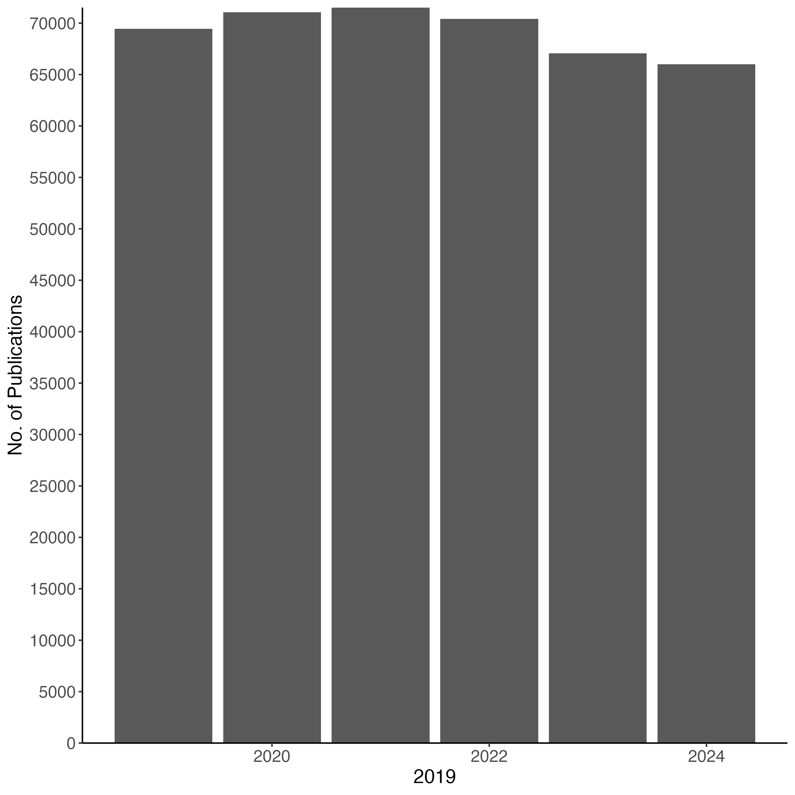
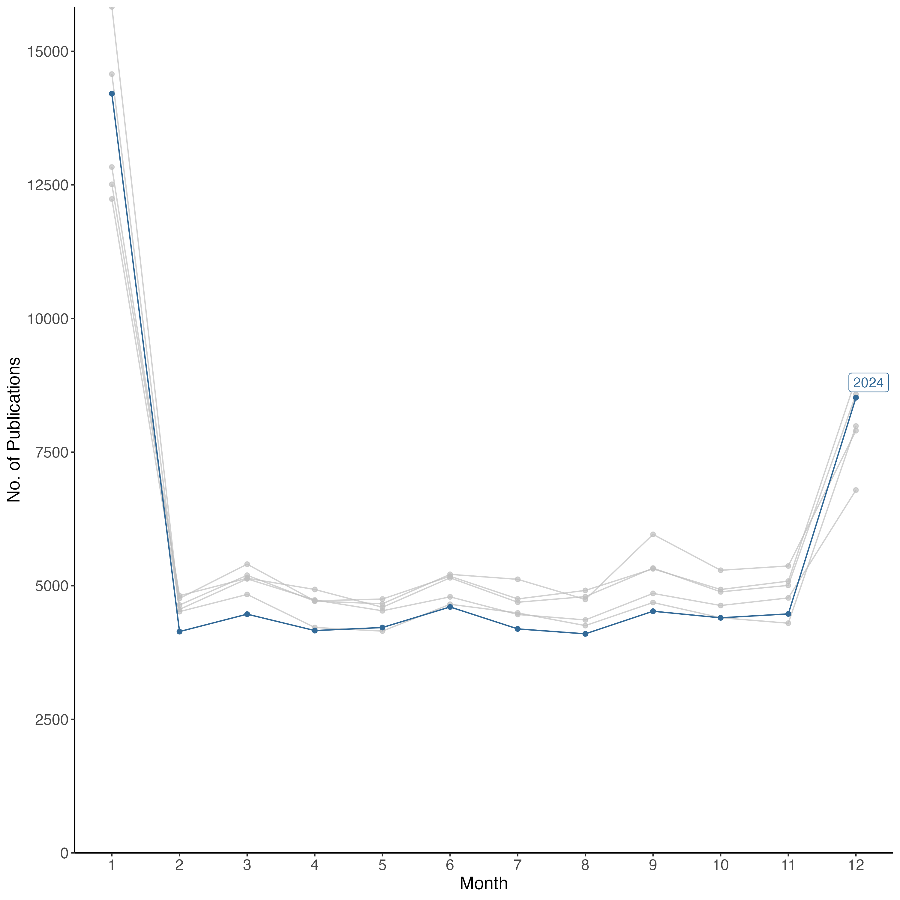
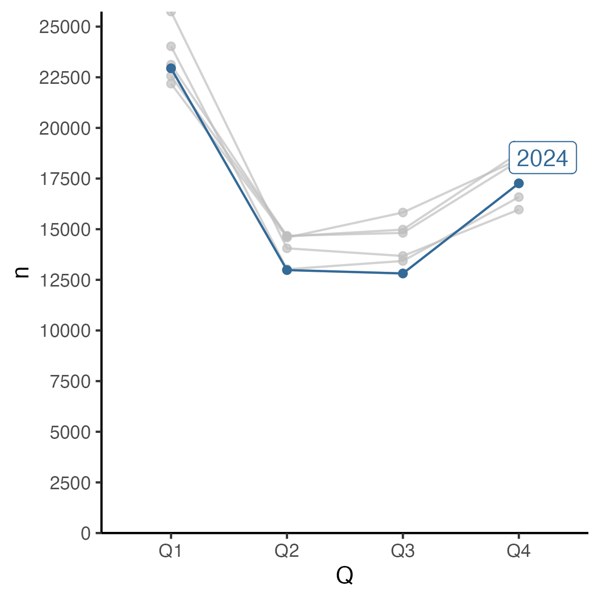
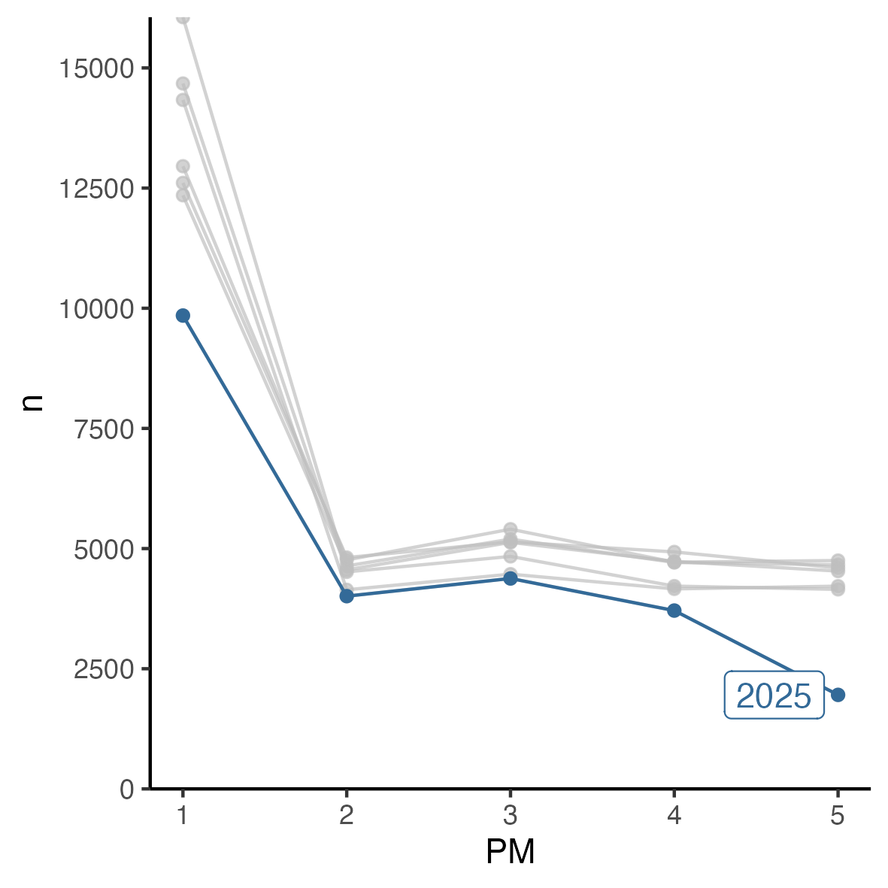
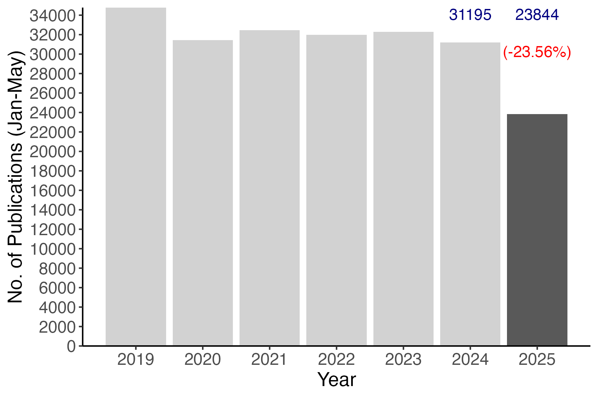
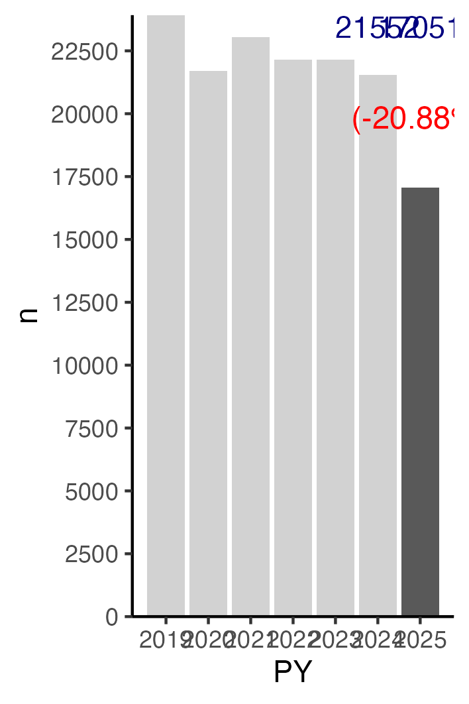
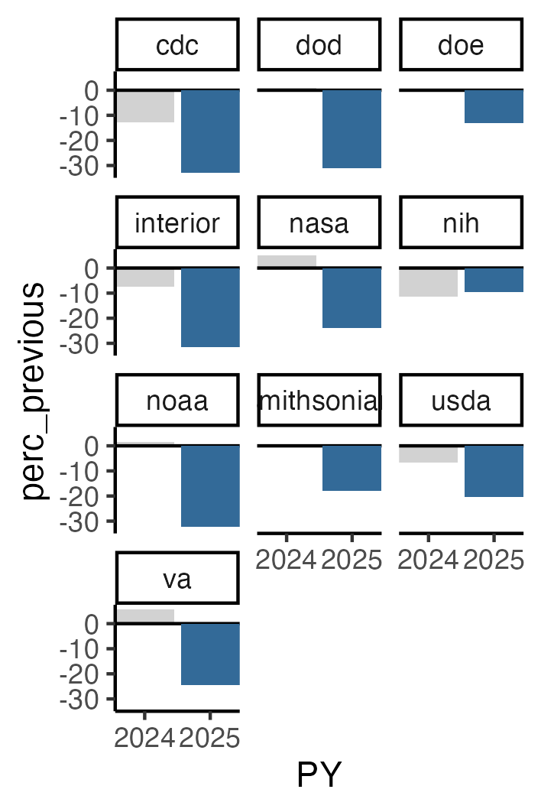
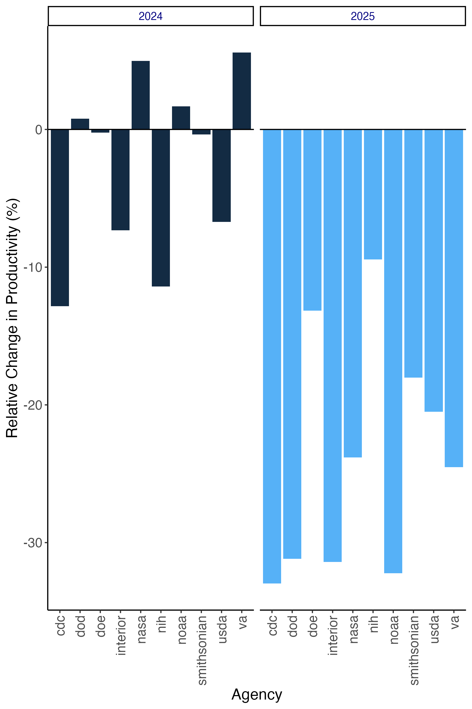

# Publications by US Federal Personnel (Jan 2019 - July 1 2025)

# Immediate Consequences of US Administration Policies on Scientific Productivity by Federal Agencies

\bigskip

```{r setup, include=FALSE}

library(tidyverse)
library(janitor)
library(gghighlight)
library(kableExtra)
# library(knitr)

knitr::opts_chunk$set(echo = FALSE, message=FALSE,warning=FALSE)

options(scipen=999)

comma <- function(x) format(x, digits = 2, big.mark = ",")

knitr::opts_chunk$set(fig.pos = 'H')

```


```{r data, cache=TRUE }

# Read data
#  fed affils -------------------------------------------------------------
# 


papers_df  <- read_rds("./data_clean/papers_df_clean.rds") %>% 
  mutate(PM=
           case_when(
             is.na(PM) ~ sample(c(1:12), 1, replace = TRUE),
             .default = as.numeric(PM)
             )
         )


authors_df  <- read_rds("./data_clean/authors_df_clean.rds") 
# 
# authors_df %>% filter(agency=="interior") %>% select(AF,authorID) %>% group_by(AF) %>% tally() %>% arrange(desc(n))


# affils_df  <- readRDS("./data_clean/affils_df_clean.rds") 

# UNIVERSITIES


# papers_df  <- read_rds("./data_clean/papers_df_uni_clean.rds") %>% 
#   mutate(PM=
#            case_when(
#              is.na(PM) ~ sample(c(1:12), 1, replace = TRUE),
#              .default = as.numeric(PM)
#              )
#          )
# 
# 
# 
# authors_df  <- read_rds("./data_clean/authors_df_uni_clean.rds") 

```

```{r totals }

total_pubs<-papers_df %>% 
  summarize(n=n_distinct(refID))

# Total_authors (fed+non)
total_authors<-authors_df %>% 
  select(authorID) %>% 
  distinct() %>% 
  tally()


total_federals<-authors_df %>% 
  filter(federal==TRUE) %>% 
  select(authorID) %>% 
  distinct() %>% 
  tally()

total_NOTfederals<-authors_df %>% 
  filter(federal==FALSE) %>% 
  select(authorID) %>% 
  distinct() %>% 
  tally() 
  

first_authors <- authors_df %>%
  filter(federal == TRUE) %>%
  filter(author_order == 1) 


prop_papers_fed_1st<-nrow(first_authors)/ total_pubs*100

last_authors <- authors_df %>%
  group_by(refID) %>%
  slice_tail() %>%
  filter(author_order != 1) %>%
  filter(federal == TRUE) 

prop_papers_fed_last<-nrow(last_authors)/ total_pubs*100


all_author_positions <- authors_df %>%
  filter(federal == TRUE) %>%
  distinct(refID,agency,.keep_all=TRUE) %>% 
  arrange(refID)

```


```{r authors_per_pub }
# Authors per pub

auth_per_pub<-authors_df %>% 
  group_by(refID) %>% 
summarize(fed=sum(federal==TRUE),
          nonFed=sum(federal==FALSE),
          total=sum(fed+nonFed))

auth_per_pub_means<-auth_per_pub %>% 
  ungroup() %>% 
  drop_na() %>% 
  summarize(
    avg_Fed=mean(fed),
    sd_Fed=sd(fed),
    avg_NonFed=mean(nonFed),
    sd_NonFed=sd(nonFed),
    avg_Total=mean(total),
    sd_Total=sd(total)
    ) %>%  
 pivot_longer(
    cols = starts_with("avg_"),
    names_to = "author_category",
    names_prefix = "avg_",
    values_to = "mean_per_pub",
    values_drop_na = TRUE
  ) %>% 
  mutate(sd=if_else(author_category=="Total",sd_Total,NA)) %>% 
  mutate(sd=if_else(author_category=="NonFed",sd_NonFed,sd)) %>% 
  mutate(sd=if_else(author_category=="Fed",sd_Fed,sd)) %>% 
  select(-sd_Fed,-sd_NonFed,-sd_Total) 

# number of scopus IDs searched 
no_fed_affils_srch<-authors_df %>% select(source) %>% mutate(source=gsub("affil_","",source)) %>% mutate(source=gsub(".csv","",source)) %>% mutate(source=gsub("_2019","",source)) %>% 
mutate(source=gsub("_2020","",source)) %>% 
mutate(source=gsub("_2021","",source)) %>% 
mutate(source=gsub("_2022","",source)) %>% 
mutate(source=gsub("_2023","",source)) %>% 
mutate(source=gsub("_2024","",source)) %>% 
mutate(source=gsub("_2025","",source)) %>% 
distinct() %>% 
summarize(n=n_distinct(source))


# Number of federal affiliations returned

no_fed_affils<-authors_df %>% filter(federal==TRUE) %>% summarize(n=n_distinct(affil_id))

# %>% 
#   rename(SD=sd,
#          `Mean per Paper`=mean_per_pub,
#          `Author Category`=author_category)
  
# 
# auth_per_pub_means %>%
# kable(digits = 2,
#   format = "latex",
#   align = "lcc",
#   caption = "Avg No of Federal and NonFederal Authors Per Publication",
#   escape = FALSE,
#   row.names = FALSE,
#   booktabs = T,
#   linesep = ""
# ) %>%
#   kable_styling(
#     bootstrap_options = c("hover"),
#     # full_width = F,
#     latex_options = c("scale_down","hold_position"),
#     font_size = 12,
#     position = "center"
#   )

```


<!-- https://www.pnas.org/author-center/submitting-your-manuscript#article-types -->
_PNAS Brief Reports_ describe observations of immediate impact that may hold potential to initiate new avenues of research, provide compelling new data on controversies of broad interest and long-standing questions, or present a concise conceptual advance.

All Brief Reports are published immediate open access.

- Brief Reports are limited to 3 pages, which is approximately 1,600 words (including the manuscript text, title page, abstract, and figure legends), and 15 references.

- Supporting information (SI) is limited to extended methods, essential supporting datasets, and videos (no additional tables or figures).

- All Brief Reports follow the Direct Submission mode of review and are not eligible as member-contributed submissions


I searched SCOPUS for all indexed articles, reviews, letters, notes, book chapters, data papers, and editorial material published between 2019-2025 that included at least one author with a United States federal government affiliation as their primary address. The search was conducted using Scopus' Affiliation Codes, the list of codes included both the primary codes for government agencies (i.e., US Department of Defense: 60012471; US Department of Commerce: 60000947) and for individual units within administered by those departments (Naval Dental Center: 60032984, National Oceanic and Atmospheric Administration: 60027716).  

_Note:_ Some USGS scientists are based at US universities via the Cooperative Fish and Wildlife Research Units Program. While these publications are returned by SCOPUS searches of the USGS code, the affiliation given for the USGS authors is that of the host university (e.g., USGS Scientists at the Florida Cooperative Fish and Wildlife Research Unit is "University of Florida"). To correct this I downloaded metadata from USGS [Publications Warehouse](https://pubs.usgs.gov/) for the N = 17,445 articles published between 2019-2025 and used it to identify all USGS authors and correct their affiliation in the SCOPUS records. 

\bigskip

# Summary: Total Publications, Total Authors, and Publications Per Year

\bigskip

## Search (SCOPUS API)


- **No. of Federal Affil SCOPUS IDs searched:** N = `r comma(no_fed_affils_srch$n)`. 

- **No. of Federal Affil SCOPUS IDs returned:** N = `r comma(no_fed_affils$n)`  


## Results 
- **Total No. of Publications:** N = `r comma(total_pubs$n)`  

- **Total No. of Authors:** N = `r comma(total_authors$n)`. 

  > Authors with Federal Affiliation (Primary): N = `r comma(total_federals$n)`  

  > Non-Federal Authors: N = `r comma(total_NOTfederals$n)`

- **Author Position **

  > Articles with Federal Author in 1st Author Position:  `r comma(prop_papers_fed_1st)`%

  > Articles with Federal Author in Last Author position:  `r comma(prop_papers_fed_last)`%

- **Authors per Publication**: 

  > Authors Per Publication: Mean = `r comma(as.numeric(auth_per_pub_means %>% filter(author_category=="Total") %>% select(mean_per_pub)))` (± `r comma(as.numeric(auth_per_pub_means %>% filter(author_category=="Total") %>% select(sd)))` SD)

  > Federal Authors per Publication: Mean  = `r comma(as.numeric(auth_per_pub_means %>% filter(author_category=="Fed") %>% select(mean_per_pub)))` (± `r comma(as.numeric(auth_per_pub_means %>% filter(author_category=="Fed") %>% select(sd)))` SD)

  > Non-Federal Authors per Publication Mean = `r comma(as.numeric(auth_per_pub_means %>% filter(author_category=="NonFed") %>% select(mean_per_pub)))` (± `r comma(as.numeric(auth_per_pub_means %>% filter(author_category=="NonFed") %>% select(sd)))` SD)

\bigskip


<!-- ## Journals -->

<!-- ## Journals -->

```{r journals }

journals <- papers_df %>%
  select(refID, DI,SO, PY, PM) %>%
  mutate_all(tolower)


all_jrnls <- journals %>%
  group_by(SO) %>%
  tally() %>%
  arrange(desc(n)) 


top_X_jrnls <- journals %>%
  group_by(SO) %>%
  tally() %>%
  arrange(desc(n)) %>%
  slice_head(n = 20)


top_N_jrnls_peryr <-
  journals %>%
  group_by(PY, SO) %>%
  tally() %>%
  arrange(desc(PY), desc(n)) %>%
  group_by(PY) %>%
  slice_head(n = 5)

```


### Total papers by year (2019-2025 to date)

```{r pubs_year}

# papers by yr
pubs_yr <- papers_df %>%
  group_by(PY) %>%
  tally() %>%
  arrange(PY)

# pubs_yr_tbl<-
# pubs_yr %>% 
# kable(digits = 2,
#   format = "latex",
#   align = "ll",
#   escape = FALSE,
#   row.names = FALSE,
#   booktabs = T,
#   linesep = ""
# ) %>% 
#   kable_styling(
#     bootstrap_options = c("hover"),
#     # full_width = F,
#     latex_options = c("scale_down"),
#     latex_options = c("hold_position"),
#     font_size = 12,
#     position = "center"
#   )

pubs_yr_1<-pubs_yr %>% 
  filter(PY<2025) %>% 
  ggplot(aes(x=PY, y=n)) +
  labs(y = "No. of Publications", size=5)+
  labs(x = "Year", size=5)+
  geom_bar(stat="identity")+
  expand_limits(y = 0)+
  theme_classic()+
  theme(axis.title.y = element_text(size = 14))+
  theme(axis.title.x =element_text(size = 14))+
  theme(axis.text.y = element_text(size = 12))+
  theme(axis.text.x =element_text(size = 12))+
  scale_y_continuous(expand = c(0, 0), breaks=seq(0,85000,by=5000))+
  scale_x_continuous(seq(2019, 2024, by=1))

ggsave("./images/pubs_yr_1.png", width = 8, height = 8, units = "in")
# +
#   gghighlight(PY == 2025)
```

```{r  label = pubs_yr_1, echo = FALSE, fig.cap = "Publications per year (2019-2024)", out.width = '75%'}

```

### Articles Published Monthly (January-December 2019-2024)

\bigskip

```{r pubs_monthly1, fig.align='center',fig.cap="Articles per month (2019-2024).",fig.height = 4,fig.width=4}

### Papers per month per year 2019-2024
pubs_mo_yr <-
  papers_df %>%
  group_by(PM, PY) %>%
  tally() %>%
  mutate(PM=as.numeric(PM),
         PY=as.numeric(PY)) %>% 
  arrange(PY, PM) %>% 
  ungroup() %>% 
  mutate(month=row_number())

pubs_per_quarter<-pubs_mo_yr %>% 
  mutate(PM=as.numeric(PM)) %>% 
  mutate(Q=cut(PM, breaks = c(0, 3, 6, 9,12), 
               labels = c("Q1", "Q2", "Q3", "Q4"))) %>% 
  group_by(PY,Q) %>% 
  summarize(n=sum(n))

pubs_mo_yr_1<-pubs_mo_yr %>% 
  filter(PY<2025) %>% 
  ggplot(aes(x=PM, y=n,group=PY,color=PY)) +
  labs(x = "Month", size=5)+
  labs(y = "No. of Publications", size=5)+
  geom_line() + 
  geom_point()+
  expand_limits(y = 0)+
  theme_classic()+
  scale_x_continuous( breaks=seq(1,12,by=1))+
  scale_y_continuous(expand = c(0, 0), breaks=seq(0,(max(pubs_mo_yr %>% select(n))+5000),by=2500))+
  theme(axis.text.y = element_text(size = 12))+
  theme(axis.text.x =element_text(size = 12))+
  theme(axis.title.y = element_text(size = 14))+
  theme(axis.title.x =element_text(size = 14))+
  # scale_y_continuous(expand = c(0, 0), n.breaks = 20, limits = c(0, max(pubs_mo_yr %>% select(n))+500))+
  # gghighlight(min(n) < 50)
  gghighlight(PY == 2024)

 ggsave("./images/pubs_mo_yr_1.png", width = 10, height = 10, units = "in")
```

```{r  label = pubs_mo_yr_1, echo = FALSE, fig.cap = "Articles per month (2019-2024). Note: the the January-December peaks are likely due to journals journals publishing fewer than 12 issues per year. Smoothed out somewhat by converting to publications per quarter (see below).", out.width = '75%'}

```


\bigskip
\bigskip

```{r pubs_monthly2, fig.align='center',fig.cap="Articles per Quarter (2019-2024).",fig.height = 4,fig.width=4}

pubs_per_quarter_2<-pubs_per_quarter %>% 
  filter(PY<2025) %>% 
  ggplot(aes(x=Q, y=n,group=PY,color=PY)) +
    labs(x = "Quarter", size=5)+
  labs(y = "No. of Publications", size=5)+
  geom_line() + 
  geom_point()+
  expand_limits(y = 0)+
  theme_classic()+
  theme(axis.text.y = element_text(size = 12))+
  theme(axis.text.x =element_text(size = 12))+
  theme(axis.title.y = element_text(size = 14))+
  theme(axis.title.x =element_text(size = 14))+
  # scale_y_continuous(expand = c(0, 0), n.breaks = 4, limits = c(1, ))+
  scale_y_continuous(expand = c(0, 0), breaks=seq(0,(max(pubs_per_quarter %>% select(n))+5000),by=2500))+
  # scale_y_continuous(expand = c(0, 0), n.breaks = 20, limits = c(0, max(pubs_per_quarter %>% select(n))+500))+
  # gghighlight(min(n) < 50)
  gghighlight(PY == 2024)
ggsave("./images/pubs_per_quarter_2.png", width = 10, height = 10, units = "in")

```


```{r  label = pubs_per_quarter_2, echo = FALSE, fig.cap = "Articles per Quarter (2019-2024).", out.width = '75%'}

```


### Monthly publications from January 1 to May 31 (2019-2025)

\bigskip

```{r fig_monthly_compare, fig.align='center',fig.cap="Monthly publications from January 1 to May 31 (2019-2025).",fig.height = 4,fig.width=4}

monthly_pubs_1<-pubs_mo_yr %>%
  # mutate(PM=if_else(PY==2025,5,PM)) %>% ######## THIS IS KEY
  filter(PM<8) %>% 
  ggplot(aes(x=PM, y=n,group=PY,color=PY)) +
    labs(x = "Month", size=5)+
  labs(y = "No. of Publications", size=5)+
  geom_line() + 
  geom_point()+
  expand_limits(y = 0)+
  theme_classic()+
  theme(axis.text.y = element_text(size = 12))+
  theme(axis.text.x =element_text(size = 12))+
  theme(axis.title.y = element_text(size = 14))+
  theme(axis.title.x =element_text(size = 14))+
  scale_x_continuous( breaks=seq(1,5,by=1))+
  scale_y_continuous(expand = c(0, 0), breaks = seq(0, max(pubs_mo_yr %>% select(n))+5000,by=2500))+
  # gghighlight(min(n) < 50)
  gghighlight(PY == 2025)

ggsave("./images/monthly_pubs_1.png", width = 10, height = 10, units = "in")

```


```{r  label = monthly_pubs_1, echo = FALSE, fig.cap = "Monthly publications from January 1 to May 31 (2019-2025).", out.width = '75%'}

```


### Total Publications between January 1 - May 31 (2019-2025)

\bigskip

```{r fig_total_to_date_1, fig.align='center',fig.cap="Total Publications between January 1 - May 31 (2019-2025).",fig.height = 4,fig.width=6}

total_jan_may<-pubs_mo_yr %>%
  # mutate(PM=if_else(PY==2025,5,PM)) %>% ######## THIS IS KEY
  filter(PM<8) %>% 
  group_by(PY) %>% 
  summarize(n=sum(n)) %>% 
  mutate(n_diff=n-lag(n)) %>% 
  mutate(perc_previous_yr=n_diff/lag(n)*100)


# n_2024<-total_jan_may %>% filter(PY==2024) %>% select(n)
# n_2025<-total_jan_may %>% filter(PY==2025) %>% select(n)
# perc_2425<-as.numeric((n_2025-n_2024)/n_2024*100)
# diff_2425<-n_2025-n_2024

fig_total_to_date_1<-
total_jan_may %>% 
  ggplot(aes(x=PY, y=n)) +
    labs(x = "Year", size=5)+
  labs(y = "No. of Publications (Jan-May)", size=5)+
  geom_bar(stat="identity")+
  expand_limits(y = 0)+
  theme_classic()+
  annotate(geom="text", x=2024, y=(max(total_jan_may$n)-.02*max(total_jan_may$n)), label=(total_jan_may %>% filter(PY==2024) %>% select(n)),
                 color="navyblue", size=4)+
  annotate(geom="text", x=2025, y=(max(total_jan_may$n)-.02*max(total_jan_may$n)), label=(total_jan_may %>% filter(PY==2025) %>% select(n)),
           color="navyblue", size=4)+
  
  annotate(geom="text", x=2025, y=(max(total_jan_may$n)-.13*max(total_jan_may$n)), label=paste("(", round((total_jan_may %>% filter(PY==2025) %>% select(perc_previous_yr)),2),"%)",sep=""),
           color="red", size=4)+
  scale_y_continuous(expand = c(0, 0), breaks=seq(0,(max(total_jan_may %>% select(n))+500),by=2000))+
  # scale_y_continuous(expand = c(0, 0), n.breaks = 20, limits = c(0, max(total_jan_may %>% select(n))+500))+
  scale_x_continuous( breaks=seq(2019,2025,by=1))+
  theme(axis.title.y = element_text(size = 14))+
  theme(axis.title.x = element_text(size = 14))+
  theme(axis.text.y = element_text(size = 12))+
  theme(axis.text.x =element_text(size = 12))+
  gghighlight(PY == 2025)
ggsave("./images/fig_total_to_date_1.png", width = 6, height = 4, units = "in")
```


```{r  label = fig_total_to_date_1_fig, echo = FALSE, fig.cap = "Articles published by researchers at federal agencies between January 1-May 31, 2019-2025 and the percent change in 2025 productivity relative to the same time period in 2024 (red). Numbers in blue are the number of articles published in 2024 and 2025.", out.width = '75%'}

```


```{r fig_total_to_date_2, fig.align='center',fig.cap="Percent change in articles published between Jan-May relative to the same period the previous year.",fig.height = 4,fig.width=4}
# 
# total_jan_may %>% 
#   drop_na() %>% 
#   ggplot(aes(x=PY, y=perc_previous_yr)) +
#   geom_bar(stat="identity")+
#   expand_limits(y = 0)+
#   theme_classic()+
#   annotate(geom="text", x=2025, y=(max(total_jan_may$perc_previous_yr,na.rm = TRUE)-.2*max(total_jan_may$perc_previous_yr)), label=paste("(", round((total_jan_may %>% filter(PY==2025) %>% select(perc_previous_yr)),2),"%)",sep=""),
#            color="red", size=4)+
#   scale_y_continuous(expand = c(0, 0), n.breaks = 30, limits = c((min(total_jan_may %>% select(perc_previous_yr))-10), (max(total_jan_may %>% select(perc_previous_yr))+5)))+
#   scale_y_continuous(expand = c(0, 0), breaks=seq(2019,2025,by=1))+
#   gghighlight(PY == 2025)
```


```{r fig_total_to_date_3, fig.align='center',fig.cap="Articles Published Jan-May (2019-2025).",fig.height = 4,fig.width=4}

# pubs_mo_yr %>%
#   filter(month<78) %>% 
#   ggplot(aes(x = month, y = n)) +
#   geom_line() +
#   geom_point() +
#   theme_classic() +
#   scale_y_continuous(expand = c(0, 0), n.breaks = 77, limits = c(1, 77)) +
#   scale_y_continuous(expand = c(0, 0), n.breaks = 20, limits = c(0, max(pubs_mo_yr %>% select(n)) + 500))+
#   # gghighlight(min(n) < 50)
#   gghighlight(PY == 2025)


```

\newpage

## 20 Agencies producing the most Publications from 1 January 2019 to 31 May 2025.

\bigskip


```{r agency_n, fig.align='center',fig.cap="20 Agencies producing the most Publications from 1 January 2019 to 31 May 2025",fig.height = 8,fig.width=6}

# total_pubs_per_agency <- agency_authors %>%
#   select(-n_agencies, -refID) %>%
#   filter(PY<2025) %>% 
#   group_by(PY) %>%
#   summarise(across(where(is.numeric), sum)) %>%
#   pivot_longer(!PY, names_to = "agency", values_to = "count") %>%
#   ungroup() %>% 
#   group_by(agency) %>%
#   summarize(n = sum(count)) %>%
#   arrange(n)
# pubs_per_agency

total_pubs_per_agency <- authors_df %>% 
  filter(federal==TRUE) %>% 
  mutate(agency=if_else(agency=="us department of the interior", "interior",agency)) %>% 
  mutate(agency=if_else(agency=="federal reserve system", "frs",agency)) %>% 
  mutate(agency=if_else(agency=="us department of defense", "dod",agency)) %>% 
  select(refID,agency) %>% 
  distinct() %>% 
  drop_na() %>% 
  group_by(agency) %>% 
  summarize(n=n_distinct(refID)) %>% 
  arrange(desc(n))

agencies_past_20<-total_pubs_per_agency %>% 
  select(agency) %>% slice(21:nrow(total_pubs_per_agency)) %>% 
  mutate(agency=toupper(agency)) %>%  
  mutate(agency=if_else((agency=="STATE"|
                          agency=="EDUCATION"|
                          agency=="CONGRESS"|
                          agency=="TREASURY"|
                          agency=="LABOR"|
                          agency=="OTHER"),
                        str_to_title(agency),
                        agency)
  )

# agencies_past_20[1,]<-paste("Other agencies: ",agencies_past_20[1,],sep="")
# agencies_past_20[5,]<-paste(agencies_past_20[5,],"\n",sep="")
# agencies_past_20[10,]<-paste(agencies_past_20[10,],"\n",sep="")
# agencies_past_20[15,]<-paste(agencies_past_20[15,],"\n",sep="")
# agencies_past_20[20,]<-paste(agencies_past_20[20,],"\n",sep="")

  agencies_past_20<-agencies_past_20 %>% mutate_all(tolower)
agencies_over_20_1<-paste(agencies_past_20$agency[1:10],collapse=",") 
agencies_over_20_2<-paste(agencies_past_20$agency[11:20],collapse=",") 
agencies_over_20_3<-paste(agencies_past_20$agency[21:30],collapse=",") 
agencies_over_20_4<-paste(agencies_past_20$agency[31:40],collapse=",") 
agencies_over_20_5<-paste(agencies_past_20$agency[41:50],collapse=",") 
agencies_over_20_6<-paste(agencies_past_20$agency[51:60],collapse=",") 
agencies_over_20_7<-paste(agencies_past_20$agency[61:77],collapse=",") 

  # affils_df %>% 
  # filter(federal==TRUE) %>% 
  # group_by(agency,PY) %>% 
  # tally() %>% 
  # ungroup() %>% 
  # group_by(agency) %>% 
  # tally() %>% 
  # arrange(n)


total_pubs_per_agency %>%
  slice_head(n=20) %>% 
  mutate(agency=toupper(agency)) %>% 
  mutate(agency=if_else((agency=="INTERIOR"|
                          agency=="COMMERCE"|
                          agency=="SMITHSONIAN"|
                          agency=="COMMERCE"|
                          agency=="STATE"|
                          agency=="FEDERAL RESERVE SYSTEM"|
                          agency=="OTHER"),
                        str_to_title(agency),
                        agency)
  ) %>% 
  rename(Agency=agency,
         N=n) %>% 
kable(digits = 2,
  format = "latex",
  caption = "N = 20 agencies producing the most publications",
  align = "ll",
  escape = FALSE,
  row.names = FALSE,
  booktabs = T,
  linesep = ""
) %>%
  kable_styling(
    bootstrap_options = c("hover"),
    # full_width = F,
    latex_options = c("scale_down","hold_position"),
    font_size = 12,
    position = "center"
  ) 

# %>% 
#   add_footnote(agencies_over_20,notation = "symbol") %>% 
#   column_spec(2, width = "5em")

```

\bigskip  
\bigskip  

<!-- **_Other agencies:_**  -->

<!-- `r agencies_over_20_1`   -->
<!-- `r agencies_over_20_2` -->
<!-- `r agencies_over_20_3`   -->
<!-- `r agencies_over_20_4` -->
<!-- `r agencies_over_20_5`   -->
<!-- `r agencies_over_20_6` -->
<!-- `r agencies_over_20_7`   -->


### Total Publications January - May (Agencies with  more than 10,000 articles only)


```{r agency_n_decline_first1, fig.align='center',fig.cap="Percent change in publicaitons (Jan-May) relative to same period prvious year. Only agencies producing over 10000 articles between 2019-2024.",fig.height = 4,fig.width=6}

agency_subset_over10K <- total_pubs_per_agency %>%
  filter(n > 10000) %>%
  select(agency,n) %>% 
  arrange(desc(n))

agency_subset_less10K <- total_pubs_per_agency %>%
  filter(n < 10000) %>%
  select(agency,n) %>% 
  arrange(desc(n))

agency_subset<-agency_subset_over10K$agency


agency_n_decline_first <-
  first_authors %>%
  filter(agency %in% agency_subset) %>%
  # mutate(PM=if_else(PY==2025,5,PM)) %>%
  filter(PM<8) %>%
  group_by(agency, PY) %>%
  tally() %>%
  group_by(agency) %>%
  mutate(decline_n = (n - lag(n))) %>%
  mutate(perc_previous = ((decline_n) / lag(n)) * 100) %>% 
  mutate(author_position="first")

agency_n_decline_last <-
  last_authors %>%
  filter(agency %in% agency_subset) %>%
  # mutate(PM=if_else(PY==2025,5,PM)) %>%
  filter(PM<8) %>%
  group_by(agency, PY) %>%
  tally() %>%
  group_by(agency) %>%
  mutate(decline_n = (n - lag(n))) %>%
  mutate(perc_previous = ((decline_n) / lag(n)) * 100) %>% 
  mutate(author_position="last")


agency_n_decline_any <-
  all_author_positions %>%
  filter(agency %in% agency_subset) %>%
  # mutate(PM=if_else(PY==2025,5,PM)) %>%
  filter(PM<8) %>%
  group_by(agency, PY) %>%
  tally() %>%
  group_by(agency) %>%
  mutate(decline_n = (n - lag(n))) %>%
  mutate(perc_previous = ((decline_n) / lag(n)) * 100) %>% 
  mutate(author_position="any")

agency_n_decline<-bind_rows(agency_n_decline_first,agency_n_decline_last,agency_n_decline_any) %>% mutate(PY=as.numeric(PY))


agency_n_decline_sum<- agency_n_decline %>% 
  filter(author_position=="any") %>% 
  select(agency,PY,n) %>% 
  group_by(PY) %>% 
  summarize(n=sum(n)) %>% 
  mutate(n_diff=n-lag(n)) %>% 
  mutate(perc_previous_yr=n_diff/lag(n)*100)
ggsave("./images/agency_n_decline_sum.png", width = 4, height = 6, units = "in")
agency_n_decline_sum<-agency_n_decline_sum %>% 
  ggplot(aes(x=PY, y=n)) +
    labs(x = "Year", size=5)+
  labs(y = "No. of Publications  (Jan-May)", size=5)+
  geom_bar(stat="identity")+
  expand_limits(y = 0)+
  theme_classic()+
  geom_hline(yintercept = 0)+
  annotate(geom="text", x=2024, y=(max(agency_n_decline_sum$n)-.02*max(agency_n_decline_sum$n)), label=(agency_n_decline_sum %>% filter(PY==2024) %>% select(n)),
                 color="navyblue", size=4)+
  annotate(geom="text", x=2025, y=(max(agency_n_decline_sum$n)-.02*max(agency_n_decline_sum$n)), label=(agency_n_decline_sum %>% filter(PY==2025) %>% select(n)),
           color="navyblue", size=4)+
  annotate(geom="text", x=2025, y=(max(agency_n_decline_sum$n)-.17*max(agency_n_decline_sum$n)), label=paste("(", round((agency_n_decline_sum %>% filter(PY>2024) %>% select(perc_previous_yr)),2),"%)",sep=""),
           color="red", size=4)+
  scale_y_continuous(expand = c(0, 0), breaks=seq(0, max(agency_n_decline_sum %>% select(n))+5000,by=2500))+
  scale_x_continuous( breaks=seq(2019,2025,by=1))+
  theme(axis.title.x = element_text(size = 14))+
  theme(axis.title.y = element_text(size = 14))+
  theme(axis.text.y = element_text(size = 12))+
  theme(axis.text.x =element_text(size = 12))+
  gghighlight(PY == 2025)

ggsave("./images/agency_n_decline_sum.png", width = 6, height = 4, units = "in")

# 
# agency_n_decline %>%
#   filter(author_position=="any") %>% 
#   filter(PY>2022) %>% 
#   drop_na() %>%
#   ggplot(aes(x = PY, y = n, group = agency, color = agency)) +
#   # ggplot(aes(x = PY, y = perc_previous, group = agency, color = agency)) +
#   # ggplot(aes(x=PY,y=n, group=agency, color=agency)) +
#   geom_point() +
#   geom_line() +
#   theme_classic() +
#   facet_wrap(vars(agency), scales = "free")
# +
  # scale_y_continuous(expand = c(0, 0), breaks = c(2019, 2025)) 


compare_agency_2425 <-
  agency_n_decline %>%
  drop_na() %>%
  filter(PY > 2023)
# 
# agency_n_decline %>%
#   drop_na() %>%
#   filter(PY > 2023) %>%
#   ggplot(aes(x = PY, y = perc_previous, group = agency, color = agency)) +
#   # ggplot(aes(x=PY,y=n, group=agency, color=agency)) +
#   geom_point() +
#   geom_line() +
#   theme_classic() +
#   facet_wrap(vars(author_position))+
#   scale_y_continuous(expand = c(0, 0), breaks = c(2019, 2025)) 
# +
  # scale_y_continuous(expand = c(0, 0), limits = c(0, 2000))+
  # gghighlight((perc_previous < -.5))
```


```{r  label = agency_n_decline_sum, echo = FALSE, fig.cap = "Number of articles Published between Jan-May (for agencies producing over 10,000 articles between Jan 2019 and May 2025) and the percent change in 2025 productivity relative to the same time period in 2024 (red). Numbers in blue are the number of articles published in 2024 and 2025.", out.width = '75%'}

```


### Publications per Agency (Agencies with > 10,000 Publications)

<!-- #### Productivity January-May Relative to same period previous year -->


```{r agency_n_decline_first2, fig.align='center',fig.cap="Percent change in number of articles published Jan-May relative to the same time period the previous year..",fig.height = 6,fig.width=4}
agency_n_decline_2<-
agency_n_decline %>%
  drop_na() %>%
  filter(author_position=="any") %>% 
  filter(PY > 2023) %>%
  ggplot(aes(x = PY, y = perc_previous, fill = PY)) +
  geom_bar(stat = "identity", position = "dodge") +
  scale_x_continuous(expand = c(0, 0), breaks = c(2024, 2025))+
  labs(x = "Year", size=5)+
  labs(y = "Relative Change in Productivity (%)", size=5)+
  theme_classic() +
  theme(legend.position="none")+
  theme(axis.text.y = element_text(size = 12))+
  theme(axis.text.x =element_text(size = 12))+
  theme(axis.title.y = element_text(size = 14))+
  theme(axis.title.x =element_text(size = 14))+
  geom_hline(yintercept = 0) +
  facet_wrap(vars(agency),ncol = 3)+
  theme(strip.text = element_text(
    size = 10, color = "navy"))+
    gghighlight(PY==2025)

ggsave("./images/agency_n_decline_2.png", width = 6, height = 9, units = "in")
```


```{r  label = agency_n_decline_2, echo = FALSE, fig.cap = "Percent change in articles published from previous Jan-May (2019-2024) by the 10 most productive federal agencies or institutions.", out.width = '75%'}

```


```{r agency_n_decline_first3, fig.align='center',fig.cap="Papers Jan-May from agencies producing over 10000 articles (2019-2024).",fig.height = 4,fig.width=6}

agency_n_decline_3<-agency_n_decline %>%
  drop_na() %>%
  filter(author_position=="any") %>% 
  filter(PY > 2023) %>%
  ggplot(aes(x = agency, y = perc_previous, fill = PY, group=agency)) +
  geom_bar(stat = "identity", position = "dodge") +
    labs(x = "Agency", size=5)+
  labs(y = "Relative Change in Productivity (%)", size=5)+
  # scale_y_continuous(expand = c(0, 0), breaks = c(2024, 2025))+
  theme_classic() +
  theme(legend.position="none")+
  theme(axis.text.y = element_text(size = 12))+
  theme(axis.text.x =element_text(size = 12))+
  theme(axis.title.y = element_text(size = 14))+
  theme(axis.title.x =element_text(size = 14))+
  theme(axis.text.x = element_text(angle = 90, vjust = 0.5, hjust=1))+
  geom_hline(yintercept = 0) +
  facet_wrap(vars(PY))+
  theme(strip.text = element_text(
    size = 10, color = "navy"))
ggsave("./images/agency_n_decline_3.png", width = 6, height = 9, units = "in")
# scale_y_continuous(expand = c(0, 0), limits = c(0, 2000))+
```


```{r  label = agency_n_decline_3, echo = FALSE, fig.cap = "Papers Jan-May from agencies producing over 10000 articles (2019-2024).", out.width = '75%'}

```


<!-- ### Agencies with < 5,000 Publications (2019-2024) -->

<!-- #### Productivity January-May Relative to Previous Year January-May (2024-2025) -->


```{r}

agency_subset<-agency_subset_less10K$agency


agency_n_decline_first <-
  first_authors %>%
  filter(agency %in% agency_subset) %>%
  # mutate(PM=if_else(PY==2025,5,PM)) %>%
  filter(PM<8) %>%
  group_by(agency, PY) %>%
  tally() %>%
  group_by(agency) %>%
  mutate(decline_n = (n - lag(n))) %>%
  mutate(perc_previous = ((decline_n) / lag(n)) * 100) %>% 
  mutate(author_position="first")

agency_n_decline_last <-
  last_authors %>%
  filter(agency %in% agency_subset) %>%
  # mutate(PM=if_else(PY==2025,5,PM)) %>%
  filter(PM<8) %>%
  group_by(agency, PY) %>%
  tally() %>%
  group_by(agency) %>%
  mutate(decline_n = (n - lag(n))) %>%
  mutate(perc_previous = ((decline_n) / lag(n)) * 100) %>% 
  mutate(author_position="last")


agency_n_decline_any <-
  all_author_positions %>%
  filter(agency %in% agency_subset) %>%
  # mutate(PM=if_else(PY==2025,5,PM)) %>%
  filter(PM<8) %>%
  group_by(agency, PY) %>%
  tally() %>%
  group_by(agency) %>%
  mutate(decline_n = (n - lag(n))) %>%
  mutate(perc_previous = ((decline_n) / lag(n)) * 100) %>% 
  mutate(author_position="any")

# scale_y_continuous(expand = c(0, 0), limits = c(0, 2000))+
```


```{r agency_n_decline1, fig.align='center',fig.cap="----- (2019-2024).",fig.height = 4,fig.width = 4}

agency_n_decline<-bind_rows(agency_n_decline_first,agency_n_decline_last,agency_n_decline_any) %>% mutate(PY=as.numeric(PY))

compare_agency_2425 <-
  agency_n_decline %>%
  drop_na() %>%
  filter(PY > 2023)
# 
# agency_n_decline %>%
#   drop_na() %>%
#   filter(PY > 2023) %>%
#   ggplot(aes(x = PY, y = perc_previous, group = agency, color = agency)) +
#   # ggplot(aes(x=PY,y=n, group=agency, color=agency)) +
#   geom_point() +
#   geom_line() +
#   theme_classic() +
#   facet_wrap(vars(author_position))+
#   scale_y_continuous(expand = c(0, 0), breaks = c(2019, 2025)) 
# +
  # scale_y_continuous(expand = c(0, 0), limits = c(0, 2000))+
  # gghighlight((perc_previous < -.5))
```

```{r agency_n_decline2, fig.align='center',fig.cap="percent change from previous year in papers produced January-May.",fig.height = 5,fig.width=7}
# 
# agency_n_decline %>%
#   drop_na() %>%
#   filter(author_position=="any") %>% 
#   filter(PY > 2023) %>%
#   ggplot(aes(x = PY, y = perc_previous, fill = PY)) +
#   geom_bar(stat = "identity", position = "dodge") +
#   scale_y_continuous(expand = c(0, 0), breaks = c(2024, 2025))+
#   theme_classic() +
#   facet_wrap(vars(agency))+
#   gghighlight(PY==2025)

```


```{r agency_n_decline3, fig.align='center',fig.cap="----- (2019-2024).",fig.height = 4,fig.width=4}


# 
# agency_n_decline %>%
#   drop_na() %>%
#   filter(author_position=="any") %>% 
#   filter(PY > 2023) %>%
#   ggplot(aes(x = agency, y = perc_previous, fill = PY, group=agency)) +
#   geom_bar(stat = "identity", position = "dodge") +
#   # scale_y_continuous(expand = c(0, 0), breaks = c(2024, 2025))+
#   theme_classic() +
#   theme(axis.text.x = element_text(angle = 90, vjust = 0.5, hjust=1))+
#   facet_wrap(vars(PY))

```


Need to compare with non-government institutions. Note that they are systematically tearing apart the most proiductive institution in the world (by far) and the leading system in the world (no foreign university or system even in top 20, only two in top 30).

2019-2025 Harvard Med through T & M: 1,087,647 

2019, 156075
2020, 167548
2021, 179386
2022, 170367 
2023, 164971
2024, 167700
2025, 81590 


inst, affil_code, inst_code
Harvard Medical School, 441574, 449547
AF-ID ( 60002746 ) OR AF-ID ( 60017087 ) OR AF-ID ( 60100090 ) OR AF-ID ( 60010869 ) OR AF-ID ( 60020482 ) OR AF-ID ( 60145297 ) OR AF-ID ( 60008361 ) OR AF-ID ( 60014986 ) OR AF-ID ( 60012535 ) OR AF-ID ( 60104690 ) OR AF-ID ( 60097350 ) OR AF-ID ( 60019829 ) OR AF-ID ( 60028457 ) OR AF-ID ( 60016830 )

Harvard University, 191469, 726046
AF-ID ( 60009982 ) OR AF-ID ( 60097058 ) OR AF-ID ( 60001001 ) OR AF-ID ( 60023563 ) OR AF-ID ( 60079465 ) OR AF-ID ( 60019666 ) OR AF-ID ( 60138961 ) OR AF-ID ( 60000650 ) OR AF-ID ( 60077735 ) OR AF-ID ( 60003705 ) OR AF-ID ( 60010402 ) OR AF-ID ( 60006303 ) OR AF-ID ( 60145297 ) OR AF-ID ( 60007624 ) OR AF-ID ( 60077572 ) OR AF-ID ( 60287955 ) OR AF-ID ( 60007773 ) OR AF-ID ( 60029819 ) OR AF-ID ( 60099481 ) OR AF-ID ( 60145405 ) OR AF-ID ( 60017150 ) OR AF-ID ( 60002746 ) OR AF-ID ( 60017087 ) OR AF-ID ( 60100090 ) OR AF-ID ( 60010869 ) OR AF-ID ( 60020482 ) OR AF-ID ( 60145297 ) OR AF-ID ( 60008361 ) OR AF-ID ( 60014986 ) OR AF-ID ( 60012535 ) OR AF-ID ( 60104690 ) OR AF-ID ( 60097350 ) OR AF-ID ( 60019829 ) OR AF-ID ( 60028457 ) OR AF-ID ( 60016830 ) OR AF-ID ( 60005856 ) OR AF-ID ( 60027452 ) OR AF-ID ( 60032499 ) OR AF-ID ( 60120583 ) OR AF-ID ( 60005478 ) OR AF-ID ( 60002564 ) OR AF-ID ( 60021507 ) OR AF-ID ( 60022098 ) OR AF-ID ( 60027409 ) OR AF-ID ( 60107878 ) OR AF-ID ( 60107841 ) OR AF-ID ( 60028031 ) OR AF-ID ( 60077569 ) OR AF-ID ( 60020680 ) OR AF-ID ( 60031821 ) OR AF-ID ( 60002294 ) OR AF-ID ( 60006332 ) OR AF-ID ( 60131697 ) OR AF-ID ( 60013733 ) OR AF-ID ( 60272417 ) OR AF-ID ( 60122560 ) OR AF-ID ( 60027589 ) OR AF-ID ( 60018380 ) OR AF-ID ( 60008668 ) OR AF-ID ( 60028849 ) OR AF-ID ( 60008789 ) OR AF-ID ( 60100185 )

University of Michigan - Ann Arbor, 347907, 418348
AF-ID ( 60025778 ) OR AF-ID ( 60073999 ) OR AF-ID ( 60009933 ) OR AF-ID ( 60155336 ) OR AF-ID ( 60155338 ) OR AF-ID ( 60023614 ) OR AF-ID ( 60007200 ) OR AF-ID ( 60019230 ) OR AF-ID ( 60008966 ) OR AF-ID ( 60018937 ) OR AF-ID ( 60012328 ) OR AF-ID ( 60013871 ) OR AF-ID ( 60033182 ) OR AF-ID ( 60155338 ) OR AF-ID ( 60013060 ) OR AF-ID ( 60022590 ) OR AF-ID ( 60009861 ) OR AF-ID ( 60027017 ) OR AF-ID ( 60112769 ) OR AF-ID ( 60019369 ) OR AF-ID ( 60032546 ) OR AF-ID ( 60016660 ) OR AF-ID ( 60008535 )


University of Washington, 329371, 373766
AF-ID ( 60015481 ) OR AF-ID ( 60156837 ) OR AF-ID ( 60011986 ) OR AF-ID ( 60292186 ) OR AF-ID ( 60116364 ) OR AF-ID ( 60014462 ) OR AF-ID ( 60032180 ) OR AF-ID ( 60073077 ) OR AF-ID ( 60091926 ) OR AF-ID ( 60138971 ) OR AF-ID ( 60138687 ) OR AF-ID ( 60008032 ) OR AF-ID ( 60008980 ) OR AF-ID ( 60156836 ) OR AF-ID ( 60001212 ) OR AF-ID ( 60032180 ) OR AF-ID ( 60012095 ) OR AF-ID ( 60028548 ) OR AF-ID ( 60138689 ) OR AF-ID ( 60033293 ) OR AF-ID ( 60138688 ) OR AF-ID ( 60000864 ) OR AF-ID ( 60091917 ) OR AF-ID ( 60006602 ) OR AF-ID ( 60279025 ) OR AF-ID ( 60016643 ) OR AF-ID ( 60278845 ) OR AF-ID ( 60028661 ) OR AF-ID ( 60156836 )


University of Pennsylvania, 269101, 368273	
AF-ID ( 60006297 ) OR AF-ID ( 60107840 ) OR AF-ID ( 60271725 ) OR AF-ID ( 60073168 ) OR AF-ID ( 60138958 ) OR AF-ID ( 60023009 ) OR AF-ID ( 60274218 ) OR AF-ID ( 60138417 ) OR AF-ID ( 60278651 ) OR AF-ID ( 60278649 ) OR AF-ID ( 60274225 ) OR AF-ID ( 60020284 ) OR AF-ID ( 60138419 ) OR AF-ID ( 60138418 ) OR AF-ID ( 60274219 ) OR AF-ID ( 60102562 ) OR AF-ID ( 60156402 ) OR AF-ID ( 60156401 ) OR AF-ID ( 60156403 ) OR AF-ID ( 60136676 ) OR AF-ID ( 60030118 ) OR AF-ID ( 60139001 ) OR AF-ID ( 60004517 ) OR AF-ID ( 60120789 ) OR AF-ID ( 60015802 ) OR AF-ID ( 60102564 ) OR AF-ID ( 60003711 ) OR AF-ID ( 60156402 ) OR AF-ID ( 60156401 ) OR AF-ID ( 60139001 ) OR AF-ID ( 60096942 ) OR AF-ID ( 60102561 ) OR AF-ID ( 60031115 ) OR AF-ID ( 60138421 ) OR AF-ID ( 60138420 ) OR AF-ID ( 60102563 ) OR AF-ID ( 60022452 ) OR AF-ID ( 60156403 )

Stanford University, 306475, 416740
AF-ID ( 60012708 ) OR AF-ID ( 60075286 ) OR AF-ID ( 60026163 ) OR AF-ID ( 60091251 ) OR AF-ID ( 60122630 ) OR AF-ID ( 60121420 ) OR AF-ID ( 60025590 ) OR AF-ID ( 60091251 ) OR AF-ID ( 60023012 ) OR AF-ID ( 60287975 ) OR AF-ID ( 60091250 ) OR AF-ID ( 60141503 ) OR AF-ID ( 60141511 ) OR AF-ID ( 60141505 ) OR AF-ID ( 60141708 ) OR AF-ID ( 60141701 ) OR AF-ID ( 60141711 ) OR AF-ID ( 60141508 ) OR AF-ID ( 60078422 ) OR AF-ID ( 60104839 ) OR AF-ID ( 60003743 ) OR AF-ID ( 60141509 ) OR AF-ID ( 60141511 ) OR AF-ID ( 60091253 ) OR AF-ID ( 60074650 ) OR AF-ID ( 60091252 ) OR AF-ID ( 60287975 ) OR AF-ID ( 60020928 ) OR AF-ID ( 60025911 ) OR AF-ID ( 60010417 ) OR AF-ID ( 60274003 ) OR AF-ID ( 60032063 ) OR AF-ID ( 60010984 ) OR AF-ID ( 60015615 ) OR AF-ID ( 60015156 ) OR AF-ID ( 60005585 ) OR AF-ID ( 60032838 ) OR AF-ID ( 60076515 ) OR AF-ID ( 60141509 ) OR AF-ID ( 60028364 ) OR AF-ID ( 60091249 ) OR AF-ID ( 60141701 )


University of California - Los Angeles, 312016, 392573
AF-ID ( 60027550 ) OR AF-ID ( 60117623 ) OR AF-ID ( 60102435 ) OR AF-ID ( 60016081 ) OR AF-ID ( 60085729 ) OR AF-ID ( 60101299 ) OR AF-ID ( 60121420 ) OR AF-ID ( 60078126 ) OR AF-ID ( 60109559 ) OR AF-ID ( 60102801 ) OR AF-ID ( 60029270 ) OR AF-ID ( 60032655 ) OR AF-ID ( 60005247 ) OR AF-ID ( 60087034 ) OR AF-ID ( 60006511 ) OR AF-ID ( 60020418 ) OR AF-ID ( 60032023 ) OR AF-ID ( 60085730 ) OR AF-ID ( 60138296 ) OR AF-ID ( 60026999 ) OR AF-ID ( 60277579 ) OR AF-ID ( 60153950 ) OR AF-ID ( 60023227 ) OR AF-ID ( 60138295 )

Massachusetts General Hospital, 209891, 215786	
AF-ID ( 60029929 ) OR AF-ID ( 60026147 ) OR AF-ID ( 60007377 ) OR AF-ID ( 60102779 ) OR AF-ID ( 60008130 ) OR AF-ID ( 60159760 )


University of California - San Francisco, 241713, 265358
AF-ID ( 60023691 ) OR AF-ID ( 60076081 ) OR AF-ID ( 60226504 ) OR AF-ID ( 60120814 ) OR AF-ID ( 60008261 ) OR AF-ID ( 60002860 ) OR AF-ID ( 60014751 ) OR AF-ID ( 60028203 ) OR AF-ID ( 60029881 ) OR AF-ID ( 60001294 ) OR AF-ID ( 60030839 ) OR AF-ID ( 60017805 ) OR AF-ID ( 60033399 ) OR AF-ID ( 60033283 ) OR AF-ID ( 60006491 ) OR AF-ID ( 60074643 ) OR AF-ID ( 60031970 ) OR AF-ID ( 60280125 ) OR AF-ID ( 60280126 ) OR AF-ID ( 60280125 )


University of California - San Diego, 264376, 288722
"AF-ID ( 60030612 ) OR AF-ID ( 60121553 ) OR AF-ID ( 60121641 ) OR AF-ID ( 60121557 ) OR AF-ID ( 60121643 ) OR AF-ID ( 60121646 ) OR AF-ID ( 60121648 ) OR AF-ID ( 60121504 ) OR AF-ID ( 60121532 ) OR AF-ID ( 60121638 ) OR AF-ID ( 60121565 ) OR AF-ID ( 60121556 ) OR AF-ID ( 60121657 ) OR AF-ID ( 60121536 ) OR AF-ID ( 60121535 ) OR AF-ID ( 60121538 ) OR AF-ID ( 60121541 ) OR AF-ID ( 60121562 ) OR AF-ID ( 60121659 ) OR AF-ID ( 60121672 ) OR AF-ID ( 60121640 ) OR AF-ID ( 60121542 ) OR AF-ID ( 60121545 ) OR AF-ID ( 60121529 ) OR AF-ID ( 60121580 ) OR AF-ID ( 60121654 ) OR AF-ID ( 60121687 ) OR AF-ID ( 60121510 ) OR AF-ID ( 60121681 ) OR AF-ID ( 60121608 ) OR AF-ID ( 60024752 ) OR AF-ID ( 60121509 ) OR AF-ID ( 60116256 ) OR AF-ID ( 60121491 ) OR AF-ID ( 60121490 ) OR AF-ID ( 60121489 ) OR AF-ID ( 60121656 ) OR AF-ID ( 60121488 ) OR AF-ID ( 60121507 ) OR AF-ID ( 60121537 ) OR AF-ID ( 60025135 ) OR AF-ID ( 60120814 ) OR AF-ID ( 60121482 ) OR AF-ID ( 60121483 ) OR AF-ID ( 60121613 ) OR AF-ID ( 60121481 ) OR AF-ID ( 60121484 ) OR AF-ID ( 60121486 ) OR AF-ID ( 60121487 ) OR AF-ID ( 60121485 ) OR AF-ID ( 60121480 ) OR AF-ID ( 60121611 ) OR AF-ID ( 60121501 ) OR AF-ID ( 60121503 ) OR AF-ID ( 60121511 ) OR AF-ID ( 60121508 ) OR AF-ID ( 60121502 ) OR AF-ID ( 60121512 ) OR AF-ID ( 60121514 ) OR AF-ID ( 60121515 ) OR AF-ID ( 60121517 ) OR AF-ID ( 60121518 ) OR AF-ID ( 60121516 ) OR AF-ID ( 60121513 ) OR AF-ID ( 60121642 ) OR AF-ID ( 60121644 ) OR AF-ID ( 60121645 ) OR AF-ID ( 60121639 ) OR AF-ID ( 60281121 ) OR AF-ID ( 60121533 ) OR AF-ID ( 60121539 ) OR AF-ID ( 60121543 ) OR AF-ID ( 60121526 ) OR AF-ID ( 60121524 ) OR AF-ID ( 60121527 ) OR AF-ID ( 60121528 ) OR AF-ID ( 60121612 ) OR AF-ID ( 60121530 ) OR AF-ID ( 60121607 ) OR AF-ID ( 60121609 ) OR AF-ID ( 60121610 ) OR AF-ID ( 60121525 ) OR AF-ID ( 60023018 ) OR AF-ID ( 60121582 ) OR AF-ID ( 60121583 ) OR AF-ID ( 60121585 ) OR AF-ID ( 60121584 ) OR AF-ID ( 60121574 ) OR AF-ID ( 60121577 ) OR AF-ID ( 60121581 ) OR AF-ID ( 60121578 ) OR AF-ID ( 60121575 ) OR AF-ID ( 60121576 ) OR AF-ID ( 60121579 ) OR AF-ID ( 60121610 ) OR AF-ID ( 60121573 ) OR AF-ID ( 60121647 ) OR AF-ID ( 60121506 ) OR AF-ID ( 60121544 ) OR AF-ID ( 60121591 ) OR AF-ID ( 60121505 ) OR AF-ID ( 60121531 ) OR AF-ID ( 60121534 ) OR AF-ID ( 60121540 ) OR AF-ID ( 60121684 ) OR AF-ID ( 60121665 ) OR AF-ID ( 60121664 ) OR AF-ID ( 60121568 ) OR AF-ID ( 60121569 ) OR AF-ID ( 60110665 ) OR AF-ID ( 60086300 ) OR AF-ID ( 60003262 ) OR AF-ID ( 60001708 ) OR AF-ID ( 60002974 ) OR AF-ID ( 60018246 ) OR AF-ID ( 60014754 ) OR AF-ID ( 60121596 ) OR AF-ID ( 60121595 ) OR AF-ID ( 60121560 ) OR AF-ID ( 60121561 ) OR AF-ID ( 60121564 ) OR AF-ID ( 60179288 ) OR AF-ID ( 60121590 ) OR AF-ID ( 60121563 ) OR AF-ID ( 60121597 ) OR AF-ID ( 60121599 ) OR AF-ID ( 60121598 ) OR AF-ID ( 60121547 ) OR AF-ID ( 60121548 ) OR AF-ID ( 60121549 ) OR AF-ID ( 60121550 ) OR AF-ID ( 60121551 ) OR AF-ID ( 60121552 ) OR AF-ID ( 60121554 ) OR AF-ID ( 60121686 ) OR AF-ID ( 60002582 ) OR AF-ID ( 60121555 ) OR AF-ID ( 60121592 ) OR AF-ID ( 60121559 ) OR AF-ID ( 60121558 ) OR AF-ID ( 60121682 ) OR AF-ID ( 60121594 ) OR AF-ID ( 60121593 ) OR AF-ID ( 60121663 ) OR AF-ID ( 60121662 ) OR AF-ID ( 60121669 ) OR AF-ID ( 60121667 ) OR AF-ID ( 60121670 ) OR AF-ID ( 60121671 ) OR AF-ID ( 60121665 ) OR AF-ID ( 60281105 ) OR AF-ID ( 60121673 ) OR AF-ID ( 60121650 ) OR AF-ID ( 60281107 ) OR AF-ID ( 60121652 ) OR AF-ID ( 60121651 ) OR AF-ID ( 60121668 ) OR AF-ID ( 60121653 ) OR AF-ID ( 60121660 ) OR AF-ID ( 60121661 ) OR AF-ID ( 60281109 ) OR AF-ID ( 60121655 ) OR AF-ID ( 60121666 ) OR AF-ID ( 60281121 ) OR AF-ID ( 60121656 ) OR AF-ID ( 60121664 ) OR AF-ID ( 60281120 ) OR AF-ID ( 60121658 ) OR AF-ID ( 60271729 )"


University of Florida, 245598, 283685	
"AF-ID ( 60013959 ) OR AF-ID ( 60138923 ) OR AF-ID ( 60154289 ) OR AF-ID ( 60154389 ) OR AF-ID ( 60027033 ) OR AF-ID ( 60154244 ) OR AF-ID ( 60138923 ) OR AF-ID ( 60012284 ) OR AF-ID ( 60024013 ) OR AF-ID ( 60122658 ) OR AF-ID ( 60122659 ) OR AF-ID ( 60154389 ) OR AF-ID ( 60122771 ) OR AF-ID ( 60001462 ) OR AF-ID ( 60006298 ) OR AF-ID ( 60019530 ) OR AF-ID ( 60122773 ) OR AF-ID ( 60122770 ) OR AF-ID ( 60122772 ) OR AF-ID ( 60024153 ) OR AF-ID ( 60008420 ) OR AF-ID ( 60007567 ) OR AF-ID ( 60154389 ) OR AF-ID ( 60019838 ) OR AF-ID ( 60007929 ) OR AF-ID ( 60010177 ) OR AF-ID ( 60018327 ) OR AF-ID ( 60026237 ) OR AF-ID ( 60075538 ) OR AF-ID ( 60004181 ) OR AF-ID ( 60030502 ) OR AF-ID ( 60017574 ) OR AF-ID ( 60122769 )"


Harvard Medical School, 120,220. 
441574, 449547
University of Michigan, Ann Arbor, 76,902
University of Washington, 70,099
University of Pennsylvania, 65,534
Stanford University, 64,915
University of California - Los Angeles, 62,180
Massachusetts General Hospital, 59,950
University of California - San Francisco, 58,970
University of California - San Diego, 58,693
University of Florida, 56,640
University of Minnesota Twin Cities, 54,421
The Ohio State University 51,023
The University of North Carolina at Chapel Hill, 50,485
University of Wisconsin-Madison, 49,806
Brigham and Women's Hospital, 49,412
Columbia University, 49,261
University of California - Berkeley, 48,039
Mayo Clinic, 47,718
Johns Hopkins University School of Medicine, 46,385
Johns Hopkins University,46,113
University of California - Davis, 45,094
Pennsylvania State University, 44,111
Massachusetts Institute of Technology, 43,977
Texas A and M University, 43,291
<!-- Chinese Academy of Sciences, 41,952 -->
The University of Texas at Austin, 41,739
UCSF School of Medicine, 41,669
<!-- CNRS Centre National de la Recherche Scientifique, 41,620 -->
University of Illinois Urbana-Champaign, 41,161
University of Pittsburgh, 41,037
<!-- National Institutes of Health (NIH), 40,815 -->
Northwestern University, 40,570
Harvard University, 40,459
Yale School of Medicine, 40,112


AFFILCOUNTRY ( united  AND states )  AND  PUBYEAR  =  2025  AND  ( LIMIT-TO ( DOCTYPE ,  "ar" )  OR  LIMIT-TO ( DOCTYPE ,  "re" )  OR  LIMIT-TO ( DOCTYPE ,  "no" )  OR  LIMIT-TO ( DOCTYPE ,  "ed" )  OR  LIMIT-TO ( DOCTYPE ,  "dp" ) )  AND  ( LIMIT-TO ( AF-ID ,  "University of Illinois Urbana-Champaign"   60000745 )  OR  LIMIT-TO ( AF-ID ,  "Johns Hopkins University School of Medicine"   60001117 )  OR  LIMIT-TO ( AF-ID ,  "Pennsylvania State University"   60001439 )  OR  LIMIT-TO ( AF-ID ,  "Harvard Medical School"   60002746 )  OR  LIMIT-TO ( AF-ID ,  "The Ohio State University"   60003500 )  OR  LIMIT-TO ( AF-ID ,  "Johns Hopkins University"   60005248 )  OR  LIMIT-TO ( AF-ID ,  "Mayo Clinic"   60005558 )  OR  LIMIT-TO ( AF-ID ,  "University of Pennsylvania"   60006297 )  OR  LIMIT-TO ( AF-ID ,  "Stanford University"   60012708 )  OR  LIMIT-TO ( AF-ID ,  "University of Florida"   60013959 )  OR  LIMIT-TO ( AF-ID ,  "University of California, Davis"   60014439 )  OR  LIMIT-TO ( AF-ID ,  "University of Washington"   60015481 )  OR  LIMIT-TO ( AF-ID ,  "Brigham and Women's Hospital"   60016782 )  OR  LIMIT-TO ( AF-ID ,  "Texas A&M University"   60020547 )  OR  LIMIT-TO ( AF-ID ,  "Massachusetts Institute of Technology"   60022195 )  OR  LIMIT-TO ( AF-ID ,  "University of California, San Francisco"   60023691 )  OR  LIMIT-TO ( AF-ID ,  "University of California, Berkeley"   60025038 )  OR  LIMIT-TO ( AF-ID ,  "The University of North Carolina at Chapel Hill"   60025111 )  OR  LIMIT-TO ( AF-ID ,  "University of Michigan, Ann Arbor"   60025778 )  OR  LIMIT-TO ( AF-ID ,  "University of California, Los Angeles"   60027550 )  OR  LIMIT-TO ( AF-ID ,  "University of Minnesota Twin Cities"   60029445 )  OR  LIMIT-TO ( AF-ID ,  "Massachusetts General Hospital"   60029929 )  OR  LIMIT-TO ( AF-ID ,  "Columbia University"   60030162 )  OR  LIMIT-TO ( AF-ID ,  "University of California, San Diego"   60030612 )  OR  LIMIT-TO ( AF-ID ,  "University of Wisconsin-Madison"   60032179 ) ) 


(LOAD-DATE > 20231231 AND LOAD-DATE < 20240601) AND ( LIMIT-TO ( DOCTYPE,"ar" ) OR LIMIT-TO ( DOCTYPE,"re" ) OR LIMIT-TO ( DOCTYPE,"ed" ) OR LIMIT-TO ( DOCTYPE,"dp" ) OR LIMIT-TO ( DOCTYPE,"no" ) OR LIMIT-TO ( DOCTYPE,"ch" ) ) AND ( LIMIT-TO ( AF-ID,"Johns Hopkins University School of Medicine" 60001117) OR LIMIT-TO ( AF-ID,"Pennsylvania State University" 60001439) OR LIMIT-TO ( AF-ID,"Harvard Medical School" 60002746) OR LIMIT-TO ( AF-ID,"The Ohio State University" 60003500) OR LIMIT-TO ( AF-ID,"Johns Hopkins University" 60005248) OR LIMIT-TO ( AF-ID,"Mayo Clinic" 60005558) OR LIMIT-TO ( AF-ID,"University of Pennsylvania" 60006297) OR LIMIT-TO ( AF-ID,"Harvard University" 60009982) OR LIMIT-TO ( AF-ID,"Stanford University" 60012708) OR LIMIT-TO ( AF-ID,"University of Florida" 60013959) OR LIMIT-TO ( AF-ID,"University of California, Davis" 60014439) OR LIMIT-TO ( AF-ID,"University of Washington" 60015481) OR LIMIT-TO ( AF-ID,"Brigham and Women's Hospital" 60016782) OR LIMIT-TO ( AF-ID,"Yale School of Medicine" 60017994) OR LIMIT-TO ( AF-ID,"Texas A&M University" 60020547) OR LIMIT-TO ( AF-ID,"Massachusetts Institute of Technology" 60022195) OR LIMIT-TO ( AF-ID,"University of California, San Francisco" 60023691) OR LIMIT-TO ( AF-ID,"University of California, Berkeley" 60025038) OR LIMIT-TO ( AF-ID,"The University of North Carolina at Chapel Hill" 60025111) OR LIMIT-TO ( AF-ID,"University of Michigan, Ann Arbor" 60025778) OR LIMIT-TO ( AF-ID,"University of California, Los Angeles" 60027550) OR LIMIT-TO ( AF-ID,"University of Minnesota Twin Cities" 60029445) OR LIMIT-TO ( AF-ID,"Massachusetts General Hospital" 60029929) OR LIMIT-TO ( AF-ID,"Columbia University" 60030162) OR LIMIT-TO ( AF-ID,"University of California, San Diego" 60030612) OR LIMIT-TO ( AF-ID,"Michigan State University" 60031707) OR LIMIT-TO ( AF-ID,"UCSF School of Medicine" 60031970) OR LIMIT-TO ( AF-ID,"University of Wisconsin-Madison" 60032179) )


US Dept of Energy 17629, 711169	

AF-ID ( 60027757 ) OR AF-ID ( 60121859 ) OR AF-ID ( 60162137 ) OR AF-ID ( 60010167 ) OR AF-ID ( 60170438 ) OR AF-ID ( 60138915 ) OR AF-ID ( 60033233 ) OR AF-ID ( 60003499 ) OR AF-ID ( 60102795 ) OR AF-ID ( 60102796 ) OR AF-ID ( 60170444 ) OR AF-ID ( 60170439 ) OR AF-ID ( 60003954 ) OR AF-ID ( 60005120 ) OR AF-ID ( 60139002 ) OR AF-ID ( 60160819 ) OR AF-ID ( 60021209 ) OR AF-ID ( 60026531 ) OR AF-ID ( 60090776 ) OR AF-ID ( 60121632 ) OR AF-ID ( 60026175 ) OR AF-ID ( 60277336 ) OR AF-ID ( 60098644 ) OR AF-ID ( 60006164 ) OR AF-ID ( 60204096 ) OR AF-ID ( 60020912 ) OR AF-ID ( 60017069 ) OR AF-ID ( 60277349 ) OR AF-ID ( 60014338 ) OR AF-ID ( 60004377 ) OR AF-ID ( 60006099 ) OR AF-ID ( 60026138 ) OR AF-ID ( 60012284 ) OR AF-ID ( 60029965 ) OR AF-ID ( 60159963 ) OR AF-ID ( 60032668 ) OR AF-ID ( 60086593 ) OR AF-ID ( 60159964 ) OR AF-ID ( 60014682 ) OR AF-ID ( 60025871 ) OR AF-ID ( 60204096 ) OR AF-ID ( 60015900 ) OR AF-ID ( 60007843 ) OR AF-ID ( 60030451 ) OR AF-ID ( 60138914 ) OR AF-ID ( 60170445 ) OR AF-ID ( 60162138 ) OR AF-ID ( 60032484 ) OR AF-ID ( 60007060 ) OR AF-ID ( 60018636 ) OR AF-ID ( 60278621 ) OR AF-ID ( 60162140 ) OR AF-ID ( 60010243 ) OR AF-ID ( 60093175 ) OR AF-ID ( 60004328 ) OR AF-ID ( 60170436 ) OR AF-ID ( 60019711 ) OR AF-ID ( 60008023 ) OR AF-ID ( 60028609 ) OR AF-ID ( 60118175 ) OR AF-ID ( 60074359 ) OR AF-ID ( 60021847 ) OR AF-ID ( 60138954 ) OR AF-ID ( 60005498 ) OR AF-ID ( 60175885 ) OR AF-ID ( 60117915 ) OR AF-ID ( 60006221 ) OR AF-ID ( 60007472 ) OR AF-ID ( 60009683 ) OR AF-ID ( 60025119 ) OR AF-ID ( 60029842 ) OR AF-ID ( 60007212 ) OR AF-ID ( 60013881 ) OR AF-ID ( 60138960 ) OR AF-ID ( 60103005 ) OR AF-ID ( 60004435 ) OR AF-ID ( 60007174 ) OR AF-ID ( 60026215 ) OR AF-ID ( 60094766 ) OR AF-ID ( 60014567 ) OR AF-ID ( 60030241 ) OR AF-ID ( 60024266 ) OR AF-ID ( 60138916 ) OR AF-ID ( 60003577 ) OR AF-ID ( 60003029 ) OR AF-ID ( 60026875 ) OR AF-ID ( 60138917 ) OR AF-ID ( 60007722 ) OR AF-ID ( 60138924 ) OR AF-ID ( 60023471 ) OR AF-ID ( 60074893 ) OR AF-ID ( 60175885 ) OR AF-ID ( 60018020 ) OR AF-ID ( 60025590 ) OR AF-ID ( 60091251 ) OR AF-ID ( 60023012 ) OR AF-ID ( 60287975 ) OR AF-ID ( 60026908 ) OR AF-ID ( 60018264 ) OR AF-ID ( 60138295 ) OR AF-ID ( 60170437 ) OR AF-ID ( 60170446 ) OR AF-ID ( 60170434 ) OR AF-ID ( 60009225 ) OR AF-ID ( 60033165 ) OR AF-ID ( 60170435 ) OR AF-ID ( 60170443 ) OR AF-ID ( 60162139 ) OR AF-ID ( 60162136 ) OR AF-ID ( 60077329 ) OR AF-ID ( 60022346 ) OR AF-ID ( 60025075 ) OR AF-ID ( 60005925 ) OR AF-ID ( 60093007 )